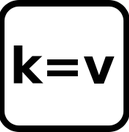
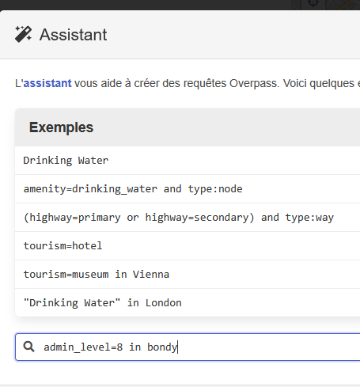
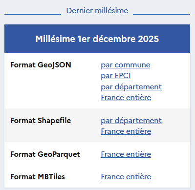
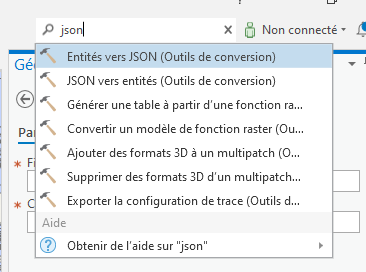

```{r setup, include=FALSE}
knitr::opts_chunk$set(echo = TRUE)
knitr::opts_chunk$set(cache = FALSE)
# Passer la valeur suivante à TRUE pour reproduire les extractions.
knitr::opts_chunk$set(eval = FALSE)
knitr::opts_chunk$set(warning = FALSE)
```

# Objet

Rechercher de la donnée

# Quel type de donnée ?

Parcourir le cours du groupe 3 et donner les 3 types de plateforme de données présentées.

-   copernic hub =\> raster

-   lidar =\> raster

-   data.gouv =\> vecteur

Le présent cours ne portera que sur des données vectorielles.

```{r}
data <- read.csv("data/data.csv", fileEncoding = "UTF-8")
knitr::kable(data)
```

Pour trouver la projection dans Arcgis Pro

clic droit sur couche / propriétés de la couche / source / référence spatiale

## Donnée OSM

-   notion de tag



-   overpasss (<https://overpass-turbo.eu/>)



## Donnée filosofi

-   Visionner le carroyage

<https://www.insee.fr/fr/outil-interactif/7737357/map.html>

pas de requêteur

Voir 200 m ou 1 km (en cours télécharger le 1 km, à la maison le 200 m)

-   carroyage

-   date

<https://www.data.gouv.fr/datasets/revenus-pauvrete-et-niveau-de-vie-donnees-carroyees/discussions>

Chercher le carroyage de 2018 à partir de : data.gouv / insee / le moteur de recherche

On doit tomber sur :

<https://www.insee.fr/fr/statistiques/7655475?sommaire=7655515>

## Cadastre

A partir de data.gouv, on tombe sur le *cadastre etalab*



On prend les parcelles de sa commune ET les limites des communes de son département.

# Intégrer la donnée dans Arcgis

Télécharger votre donnée et la mettre dans un répertoire par exemple *dataCours1*

Utiliser la fenêtre *Catalogue* pour connecter votre répertoire

Tout dépend du format de votre donnée.

-   shapefile (cliquer / glisser)

-   gpkg (cliquer / glisser)

-   geojson (json dans la zone de recherche de commandes Alt + Q)



# Sous R

## Lecture des fichiers

```{r}
library(sf)
parcelle <- st_read ("data/dataCours1/cadastre-93010-parcelles.json")
dpt <- st_read("data/dataCours1/communes.shp")
bondy <- st_read("data/dataCours1/export.geojson")
car <- st_read("data/gros/Filosofi2019_carreaux_200m_gpkg/carreaux_200m_met.gpkg")
```

## Problèmes éventuels de géométries

Attention extraction uniquement du polygone et des polygones valides

```{r}
# le geojson a des géométries différentes
summary(bondy$geometry)
bondy <- st_collection_extract(bondy, "POLYGON")
# verif des autres géométries
summary(dpt$geometry)
summary(parcelle$geometry)
table(st_is_valid(parcelle$geometry))
```

## Intersections

```{r}
# Systèmes de projection
st_crs(bondy)
st_crs(car)
st_crs(parcelle)
# Transformations de projection
bondy <- st_transform(bondy, 2154)
parcelle <- st_transform(parcelle, 2154)
# Intersections
inter1 <- st_intersection(car, bondy)
inter2 <- st_intersection(car, dpt)
# Enregistrement dans un gpkg
st_write(inter2,"data/dataCours1/car.gpkg", "dpt", delete_layer = T)
st_write(inter1,"data/dataCours1/car.gpkg", "bondy", delete_layer = T)
```

## Carto

```{r}
library(mapsf)
mf_map(parcelle, col= "wheat", border = NA)
mf_map(inter1, col = NA, border = "cadetblue1", lwd = 2 ,add = T)
mf_layout("parcelles cadastre Bondy et ses carreaux filosofi","filosofi 2018, osm\nJanvier 2026")
```

```{r}
mf_map(inter2)
mf_map(bondy, col = NA, border = "wheat", lwd=2,add = T)
mf_layout("carreaux filosofi dpt et limites ville Bondy","filosofi 2018, osm\nJanvier 2026")
```
