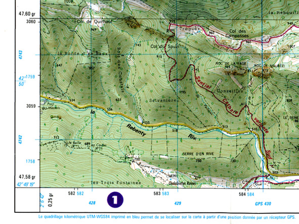
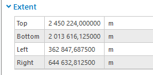
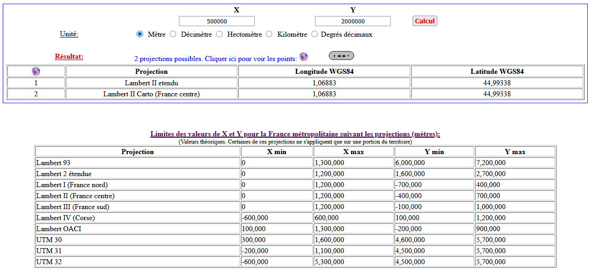
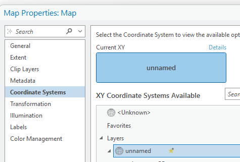
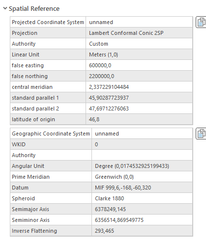
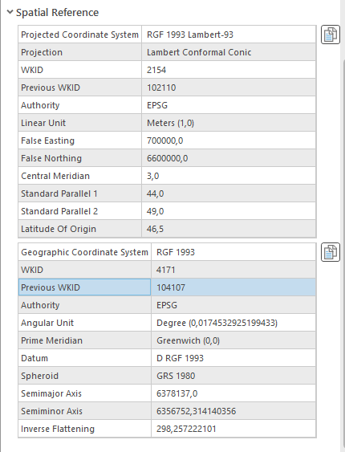
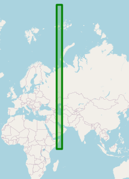

```{r setup, include=FALSE}
knitr::opts_chunk$set(echo = TRUE)
knitr::opts_chunk$set(cache = FALSE)
# Passer la valeur suivante à TRUE pour reproduire les extractions.
knitr::opts_chunk$set(eval = TRUE)
knitr::opts_chunk$set(warning = FALSE)
```

# Objet

En fait au delà de l'exercice pratique de géoréférencement, il s'agit de faire un point sur les projections.

# 3 datums à connaître

WGS84 / RGF93 / ETRS89


# WGS84 et Lambert 93

Observer une carte topo IGN : comprendre le quadrillage

2 quadrillages WGS 84 et Lambert 93



A connaître, les *emprises* de la France dans les deux systèmes

```{r}
read.csv("data/2Grilles.csv")
```

Mais il y a beaucoup d'autres grilles, tous les CRS possibles sur une zone donnée avec les emprises *CRS explorer*

Autre outil :


http://bboxfinder.com/#0.000000,0.000000,0.000000,0.000000

# Exercice 1 = trouver la projection des premiers carreaux insee

La ressource est sur le site de l'insee, terme de recherche :

*carreaux 1 km recensement population*

Il faut prendre l'item : données carroyées à 1 kilomètre

Regarder le .pdf et trouver le système de projection

Qui porte ce système ? Pourquoi l'insee choisit ce système ?

# Arcgis Pro

Sous Arcgis Pro, la donnée s'ouvre-t-elle ?

Image pb licence

Prendre plutôt le fichier mise à dispo carreauPB.gpkg.


## Emprise des données




Il faut trouver un Y de 2 millions et un X de 500 M

https://geofree.fr/gf/projguess.asp, le tableau permet de voir toutes les emprises

voire même de mettre l'ordre de grandeur de l'emprise



## Systèmes de coordonnées

### Au niveau du projet Arcgis


### Couche




Qu'en déduire ?

### R

On charge la donnée

```{r}
library(sf)
data <- st_read("data/gros/R_rfl09_LAEA1000.mid")
petit <- data [1:10,]  # pour faire des tests
```


```{r}
# une bibliothèque permmet de suggérer le crs inexistant
library(crsuggest)
coordBondy <-  c(48.9,2.46)
guess_crs(petit, coordBondy)
st_crs (petit) <- 32439
```




```{r}
# c'est un epsg qui concerne l'Azerbaidjan...
petit <- st_transform(petit, crs = 4326)
petit
```

Dommage, mais 46,21 ce n'est pas -4 / 10 ...

Heureusement, cela fonctionne sous Qgis  de façon automatique.

# Exercice 2 aire des carreaux

Angle vs Aire

Dans les faits, on mesure les carreaux, ils sont supposés faire 1 km donc... en m² ?

```{r}
hist(st_area(data$geometry))
# filtrage pour représentation carto
data <- data [c(1:13000),]
data$aire <- st_area(data$geometry)/1000000
summary(data$aire)
# pour cartographier on filtre sur les 1500 premiers carreaux
st_write(data,"data/carreauPB.gpkg", "carLeger", delete_layer = T)
```


```{r}
library(mapsf)
mf_map(data, type = "choro", var = "aire", border = NA, leg_val_rnd = 5)
mf_layout("Carreaux 1 km : évolution nord sud", "insee 2013")
```

Que dire sur la déformation de l'espace ?

# Géoréférencer un plan DAO en O,O

C'est le cas le plus fréquent en commune, les plans DAO ne sont dans aucun système de coordonnées.

Du coup, on le géoréférence à la main.
