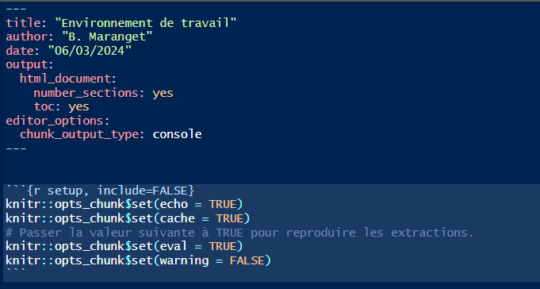

```{r setup, include=FALSE}
knitr::opts_chunk$set(echo = TRUE)
knitr::opts_chunk$set(cache = TRUE)
# Passer la valeur suivante à TRUE pour reproduire les extractions.
knitr::opts_chunk$set(eval = TRUE)
knitr::opts_chunk$set(warning = FALSE)
```

# Objet

Pour construire le site web sur lequel déposer le projet de fin de semestre, il faut deux éléments

- Projet R, markdown, _site.yml

- Concernant git, c'est plus difficile, à voir peut-être plus tard (galère probable pour les clés SSH)

# Projet R et Markdown

## Interface Rstudio

4 fenêtres

## Créer un projet R

File / Nouveau projet

Le projet permet de conserver l'emplacement des fichiers.

Créer l'arborescence suivante


## Le markdown

Créer un markdown dans le répertoire script dans Rstudio, le knitter.


## paramétrage de la TOC et de l'execution des chunks




````
---
output: 
  html_document: 
    number_sections: yes
    toc: yes
editor_options: 
  chunk_output_type: console
---
````

 Et, juste en dessous, dans un chunk avec la mention {r setup, include=FALSE}
 
 
```
knitr::opts_chunk$set(echo = TRUE)
knitr::opts_chunk$set(cache = TRUE)
# Passer la valeur suivante à TRUE pour reproduire les extractions.
knitr::opts_chunk$set(eval = TRUE)
knitr::opts_chunk$set(warning = FALSE)
```

source :

https://blog.wax-o.com/2014/04/tutoriel-un-guide-pour-bien-commencer-avec-markdown/


## Construire un site web : le _site.yml

source :

https://ymlthis.r-lib.org/reference/yml_site_opts.html#examples

### Exemple de _site.yml


```{r, eval=FALSE}
name: "L6ECSIG Construction et utilisation des SIG"
navbar:
  left:
    - text: "Introduction"
      href: 01_intro.html
    - text: "Environnement"
      href: 02_environnement.html
    - text: "Bases R"
      href: 03_basesR.html 
    - text: "R spatial"
      href: 04_Rspatial.html
    - text: "Correction"
      href: 05_correction.html 
    - text: "Donnees"
      href: 06_Donnees.html 
    - text: "Traitement"
      href: 07_traitement.html   
    - text: "Resultat"
      href: 08_resultat.html   
  right:
    - icon: fa-github
      href: https://github.com/beababa/beababa.github.io
output: 
  html_document:
    toc_float: TRUE  
    theme: united
    highlight: tango
    include:
      after_body: footer.html
    number_sections: yes
    exclude: [data-raw, data]
    css: css/styles.css
```


A noter

- attention aux accents

- à chaque knit, quels changements dans l'arborescence du projet ?

### Exercice

Construire votre _site.yml avec une intro / donnees / traitement / resultat
et sans style particulier (le css)

# Git


## Compte et projet

Créer un compte GIT et un projet


## Solution facile

Chaque étudiant crée un compte git et met en place le projet nom.github.io afin
d'avoir un site internet.

Les données seront téléchargées par l'interface graphique.

Les données téléchargées seront uniquement celles du répertoire "_site" du projet.

## Mise en place de workflow git (plus complexe)

### Cloner le projet sur sa machine

cloner le projet sur son pc avec la commande *git clone* et le lien vers le répertoire


#### Sur l'interface github

Récupérer le lien https du projet dans code


#### Dans une fenêtre cmd de windows

Pour ouvrir une fenêtre cmd, il suffit de faire le bouton windows et de taper *cmd*.


#### Installation des commandes git

Cela ne fonctionne pas ... il faut installer les commandes git sous votre machine (sous Mac et Linux c'est pré-installé)

source : https://astuces-informatique.com/comment-installer-utiliser-git-sous-windows/


Faire l'installation et essayer à nouveau de cloner...

### Clés SSH

L'utilisation des clés permet d'éviter la saisie du mot de passe.

#### Génération des clés

Pour pouvoir travailler ainsi, il faut avoir générer des clés

Ouvrir une fenêtre avec la commande cmd et saisir *ssh-keygen*

Le répertoire où la clé est créée est, par défaut, le répertoire utilisateur.
(afficher les fichiers cachés est nécessaire)


Le répertoire utilisateur est à la racine de votre profil.


source :

https://www.lojiciels.com/comment-generer-des-cles-publiques-privees-ssh-sous-windows/


#### Copie de la clé publique sur le serveur

Au niveau du github, coin haut droit *settings* puis *ssh keys*

Il s'agit de récupérer le contenu de la clé, la commande en ligne 

*clip < .ssh/id_rsa.pub*


(Sinon ouvrir le fichier et faire un copier - coller)


source :

https://docs.github.com/en/authentication/connecting-to-github-with-ssh/adding-a-new-ssh-key-to-your-github-account


#### Test

*ssh -T git@github.com*


### Mise à jour du projet : 4 commandes à connaître


````
git pull
git add .
git commit -m "version finale veille cours"
git push
````


