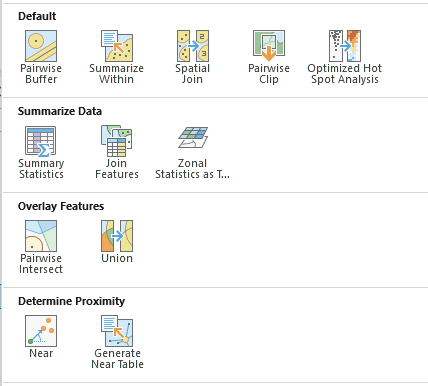
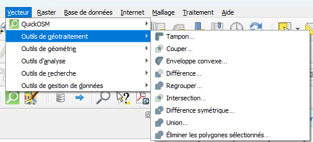
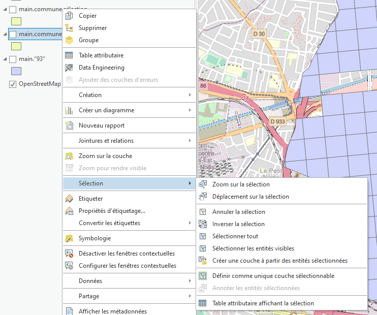
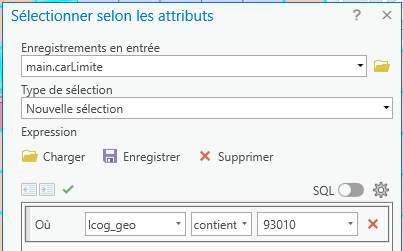
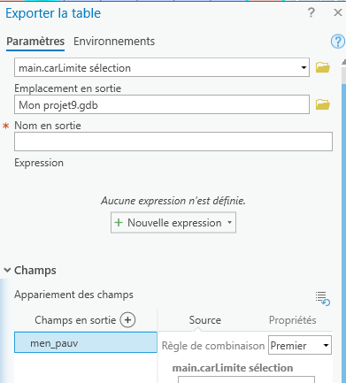
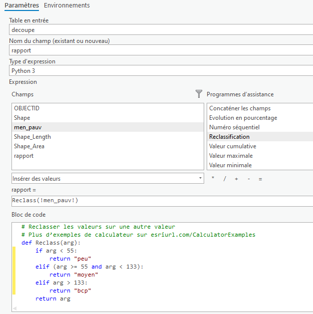

```{r setup, include=FALSE}
knitr::opts_chunk$set(echo = TRUE)
knitr::opts_chunk$set(cache = FALSE)
# Passer la valeur suivante à TRUE pour reproduire les extractions.
knitr::opts_chunk$set(eval = TRUE)
knitr::opts_chunk$set(warning = FALSE)
```

# Objet

Il ne s'agit pas ici de dessiner des points / lignes / polygones mais d'agréger / délimiter et combiner des géométries.

Ces 3 termes résument tous les outils disponibles dans les logiciels qui apportent de la complexité.

 

Une méthode très utile pour ces opérations, qu'elles soient sur du vecteur ou du raster, est de commencer par faire un shéma de géotraitement.

# Schéma de géotraitement

## Géotraitement 1 = Délimiter

```{mermaid}
flowchart LR
  A[carreaux] --> C{intersecter}
  B[limites\nCommune] --> C{intersecter}
  C --> D[carreaux délimités]
```

## Géotraitement 2 = Combiner

```{mermaid}
flowchart LR
  A[carreaux intérieur commune] --> C{combiner}
  B[carreaux limite commune] --> C{combiner}
  C --> D[carreaux combinés]
```

## Géotraitement 3 = Fusionner

```{mermaid}
flowchart LR
  A[carreaux] --> B{discrétiser les valeurs \npour distinguer pauvres / riches}
  B --> C[carreaux avec nouvel attribut]
  C --> D{Agréger par nel attribut}
  D --> E[carreaux agrégés]
```

# Données

-   les carreaux par dpt dans construction.gpkg (gros fichier = 260 M°)

-   les polygones des communes dans cours3.gpkg

-   les carreaux positionnés sur les limites des communes sont dans cours3.gpkg

Attention, il y a 2 communes en Martinique, la projection est différente (5490)

# Délimiter

Sélectionner les carreaux de sa commune dans les carreaux départementaux. Cela va couper les carreaux, comme un pochoir.

```{r}
library(sf)
# lecture des données
bondy <- st_read("data/cours3.gpkg", "commune", quiet = T)
bondy <- bondy [bondy$code == 93010,]
car <- st_read("data/gros/construction.gpkg", "93",  quiet = T) 
# intersection
inter <- st_intersection(car, bondy)
st_write(inter, "data/bondy.gpkg", "carreau", delete_layer = T,  quiet = T)
# carto
library(mapsf)
mf_map(inter, col = NA, border = "darkgoldenrod")
mf_layout("Découpage carreaux sur Bondy", "insee 2021\nOSM")
```

Egalement, zones tampons, enveloppes

## Dans Arcgis

Quel outil ?

Etape 1 : charger les couches, lesquelles ?

Etape 2 ; sélectionner la commune et enregistrer la sélection (clic droit)



Etape 3 : utiliser l'outil

# Combiner

Union, différence

```{r}
car <- st_read("data/bondy.gpkg", "carreau" ,quiet = T)
carLimite <- st_read("data/cours3.gpkg", "carLimite", quiet=T) 
carLimiteBondy <- carLimite [grep("93010", carLimite$lcog_geo),]
```

```{r}
mf_map(car, col= "cadetblue1", border = "yellow")
mf_map(carLimiteBondy, border = "deeppink4", col = NA, add = T)
mf_layout("Carreaux entiers incluant Bondy", "Insee 2021\nOSM2026")
```

## Dans Arcgis

étape 1 : on ne garde que la couche résultant de la délimitation

étape 2 : on charge les carreaux limites

étape 3 : sélection attributaire (CTRL + T) et créer une nelle couche



étape 4 : Données / Exporter les entités (ne garder que le champs ménage pauvre)



Pour sélectionner tous les champs : CTRL + A puis CTRL pour enlever men_pauv et SUPPR

Faire la même chose avec la découpe

étape 5 : réunir les 2 couches, trouver l'outil et l'utiliser

# Fusionner

phase préparatoire

Un seul champs nécessaire pour l'agrégation

```{r}
car <- car [, "men_pauv"]
# 328
carLimiteBondy <- carLimiteBondy [, "men_pauv"]
## 99
tot <- rbind(car, carLimiteBondy)
st_write(tot, "data/bondy.gpkg", "carreauTot", quiet = T, delete_layer = T)
```

Agréger carreaux riches / carreaux pauvres

```{r}
library(sf)
car <- st_read("data/bondy.gpkg", "carreauTot", quiet = T)
hist(car$men_pauv)
summary(car$men_pauv)
quantile <- quantile(car$men_pauv, na.rm = T)
car$men_pauv_rapport <- "moyen"
car$men_pauv_rapport [car$men_pauv < quantile [2]] <- "Moins de ménages pauvres" 
car$men_pauv_rapport [car$men_pauv > quantile [3]] <- "Plus de ménages pauvres" 
table(car$men_pauv_rapport)
rapport <- aggregate(car  [, c("men_pauv_rapport")], by = list(car$men_pauv_rapport), length)
```

```{r}
library(mapsf)
mf_map(rapport, type = "typo", var = "Group.1", border= NA, leg_title = "")
mf_layout("Densité des ménages pauvres", "Insee 2021\nOSM 2026")
```

## Sous Arcgis

Etape 1 : supprimer les couches inutiles

Etape 2 : recoder le champs menage pauvre



Etape 3 : quel outil pour fusionner en fonction des attributs ?
