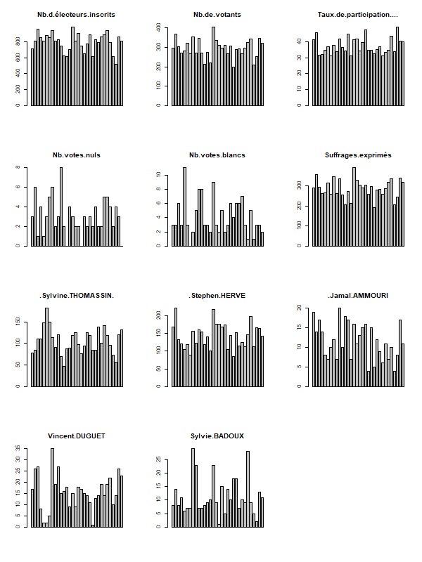

```{r setup, include=FALSE}
knitr::opts_chunk$set(echo = TRUE)
knitr::opts_chunk$set(cache = FALSE)
# Passer la valeur suivante à TRUE pour reproduire les extractions.
knitr::opts_chunk$set(eval = TRUE)
knitr::opts_chunk$set(warning = FALSE)
```

# Objet

Bases R

source : https://github.com/rstudio/cheatsheets/blob/main/base-r.pdf


# Objets R


## Vecteur et dataframe

### Creation

```{r}
nom <- c("Zachary", "Pierre", "Linda")
notes <- c(16,12,13)
```


3 trucs pour survivre :

- Alt + - pour l'opérateur d'assignation

- tabulation pour la complétion

- Ctrl + entrée pour executer la ligne de code

### Indexation

```{r}
nom [1]
notes [2]
df <- data.frame(nom, notes)
df [1,2]
```

```{r}
df$nom
df$notes
```

### Operation

```{r}
#sum(df$notes)
sum(notes)
```

## Exercice


Créer un dataframe sur 3 villes et leur nombre d'habitants
Trouver la moyenne du nombre d'habitants.


# Boucles et autres

Avec l'exemple, du fichier des élections, on introduit la notion de boucle.

Avec celui du fichier des présences, on explore les listes et les fonctions apply.


## Exemple 1 : les résultats des élections

On cherche à faire un graphique de chacun des résultats


### Import de la donnée


```{r}
data <- read.csv("data/bondyElection.csv", fileEncoding = "UTF-8", dec = ",")
head(data)
summary(data)
```

### Nettoyage

#### Problème des champs totaux

```{r}
data$Bureau.de.vote
data <-  data [-c(33,34),]
```


#### Les noms des candidats

```{r}
candidat  <- names(data)[8:12]
candidat
liste <- strsplit(candidat,"\\.\\.\\.")
liste [[5]][3]
candidat <- sapply(liste, '[', 3)
names (data) [8:12] <- candidat
names(data)
```


### Graphique

```{r}
png(height = 800, width = 600, filename = "img/resultat.png")
par(mfrow = c(4,3))
for (i in 2:12){
  barplot(data [,i], main = names(data) [i])
}
dev.off()
```



## Exemple 2 : les présents dans le cours


Cet exemple montrer les 3 types possibles de code. 

- code séquentiel

- code en boucle classique

- code R : liste et apply


source : https://r-coder.com/merge-r/

### Lecture et concaténation des tableaux

Il s'agit d'importer les .csv dans R et de les lier par prénom.

#### Sans boucle : code séquentiel

##### Import des fichiers


```{r}
# Intégration des tableaux
cours1 <- read.csv("data/cours1.csv", encoding = "UTF-8")
cours2 <- read.csv("data/cours2.csv", encoding = "UTF-8")
cours3 <- read.csv("data/cours3.csv",encoding = "UTF-8")
cours4 <- read.csv("data/cours4.csv", encoding = "UTF-8")
# Examen de la nature des champs
str(cours1)
str(cours2)
str(cours3)
str(cours4)
# rappel : pour supprimer les facteurs, le paramètre est stringsAsFactor = F
```


On remarque que c'est toujours la 2e colonne qui nous intéresse sauf pour le cours1

```{r}
coursBase <- cours1 [, c("Prénom", "X44223")]
names (coursBase)[2] <- "cours1..oui."
```

##### Fusionner les cours par prénom

C'est la fonction *merge* que l'on retrouvera en R-spatial.


```{r}
# Première fusion
cours1_2 <- merge(coursBase,cours2, all = T)
# l'option all = T permet de récupérer tous les prénoms
# Première vérification : nb de lignes du cours
str(cours1_2)
cours1_2 [, c(1:3)]
# pour la fusion suivante, les titres des colonnes sont nécessaires.
cours1_3 <- merge(cours1_2 [, c(1:3)], cours3 [, c(1,2)], by.x = "Prénom", by.y = "Prénom", all = T)
str(cours1_3)
# recodage nom des colonnes dans le tableau final
names(cours1_3) [2:4] <-  c("cours1","cours2","cours3")
```


##### Exercice : utiliser la fonction merge

Rajouter le 4e cours

Déposer le .Rmd dans le moodle avant la fin du cours. N'oubliez pas les commentaires !

### Avec une boucle


#### Exercice : poser l'algo


#### Code

```{r}
# On liste les fichiers du répertoire data
contenu <- list.files("data/")
# On remonte les indices des noms contenant "cours"
ind <- grep("cours", contenu)
# verif : il doit y en avoir 5 puisqu'il y a eu 5 cours
# on sort cours1.csv dont la structure est différente
i <- 2
#initialisation tmp et coursBase au cas où boucle tourne pl fois
tmp <- NULL
coursBase <- cours1 [, c("Prénom", "X44223")]
names (coursBase)[2] <- "cours1..oui."
for (i in 2:length(ind)){
  tmp <- read.csv(paste0("data/", contenu [ind [i]]), fileEncoding = "UTF-8")
  tmp
  coursMerge <- merge(coursBase,tmp [,c(1:2)], all = T, by = c("Prénom", "Prénom"))
  coursBase <- coursMerge
}
coursMerge
```

### En utilisant les listes et les apply


source : https://thinkr.fr/comment-faire-des-boucles-en-r-ou-pas/

#### Modèle à proposer

source : https://thinkr.fr/operations-sur-les-fichiers-et-les-dossiers-sous-r/

```{r, eval=FALSE}
# liste des csv à importer :
liste_csv <- list.files("csv_a_importer", pattern = ".csv", full.names = TRUE)
# import des données :
all_csv <- lapply(liste_csv, readr::read_csv)
# un data.frame unique :
df_csv <- dplyr::bind_rows(all_csv)
# enregistrement du dataframe :
readr::write_csv(df_csv, file = "df_csv.csv")
# on renomme le dossier
file.rename(from = "csv_a_importer", to = "csv_importes")
```

### Pour notre cas

le faire évoluer pour qu'il corresponde au cours


```{r}
# liste des csv à importer :
liste_cours <- list.files("data/", pattern = "cours", full.names = TRUE)
# import des données :
# fonction read.csv.UTF
read.csv.UTF <- function(fic) {read.csv(fic, fileEncoding = "UTF-8")}
liste <- lapply(liste_cours, read.csv.UTF)
```


Indexation des listes

```{r}
liste[[1]]
liste[[1]][1]
liste[[1]][c(1,4)]
liste [[1]] <- liste [[1]][c(1,4)]
```


## Explorations statistiques

Désormais, on utilise les apply dés que c'est possible

Exemple : Nombre de présents pour chacun des 3 cours


### Simplification de la liste

On ne retient que les 2 premières colonnes.

```{r}
listeOK <- lapply(liste, "[",1:2)
listeOK
```


## Recodage

Est-il nécessaire de recoder les NA ?

Recodage des "Oui" en "oui"

```{r}
listeOK[[1]]
coder <- function (data) {sub ("Oui","oui", data [,2])}
listeRecodée <- lapply(listeOK, coder)
listeRecodée
```


# Explorations statistiques sur les présences


```{r}
compter <- function (vec) {table(vec == "oui")}
présence <- sapply(listeRecodée, compter)
numCours <- seq (1:length (listeRecodée))
barplot(présence [2,], main = "Nombres d'étudiants",
        names.arg = numCours, xlab = "cours")
```
