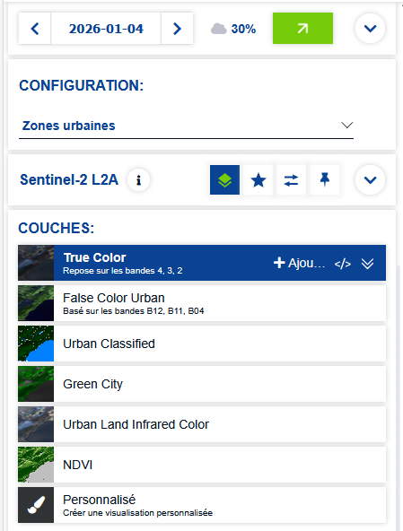
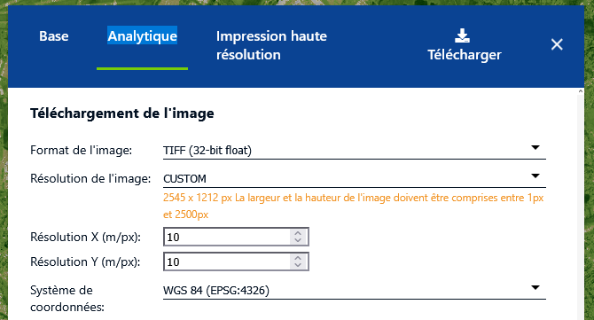
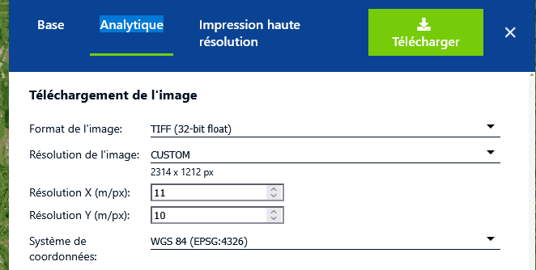
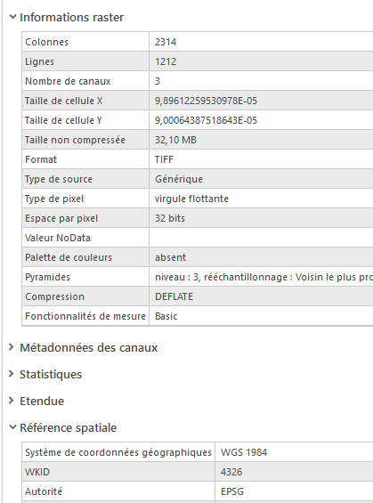
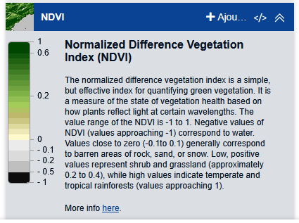

```{r setup, include=FALSE}
knitr::opts_chunk$set(echo = TRUE)
knitr::opts_chunk$set(cache = FALSE)
# Passer la valeur suivante à TRUE pour reproduire les extractions.
knitr::opts_chunk$set(eval = TRUE)
knitr::opts_chunk$set(warning = FALSE)
```

# Objet

L'objectif est de comprendre pourquoi le carroyage filosofi ne recouvre pas tout l'espace.

```{mermaid}
flowchart LR
  A[image raster] --> C{découper}
  B[carreaux vecteur] --> C{découper}
  C --> D[image hors carreau]
```

Comment s'appelle le schéma ci-dessus ?

# Utiliser copernicus hub pour obtenir une image aérienne

## Paramétrage

Déterminer la zone, de quelle manière ?

Quelle type d'image prendre ?



Téléchargement de la carte

 

Justifier les options choisies :

-   format image

-   type de résolution

-   projection

# Etapes géotraitements

## Géotraitement 1 = Reprojeter



Quelle est la taille du pixel ? S'agit-il de mètres ?

A part la taille du pixel, à quoi sert de reprojeter le raster ?

## Géotraitement 2 = Découper le raster

On se sert des carreaux manquants pour découper le raster dessus.


### Carreaux manquants

L'extraction des carreaux manquants est faite sous R par département et fournie aux étudiants.

La question à régler est sur l'importance des carreaux manquants. On fait un test sur Bondy, puis une comparaison par dpt et enfin le cas spécifique de la Martinique.

#### Bondy

Données et intersection limite commune et carreau

Chargement des couches : commune et carreaux

```{r}
library(sf)
commune <- st_read("data/cours3.gpkg", "commune", quiet=T)
bondy <- commune [commune$code == '93010',]
car <- st_read("data/gros/construction.gpkg", "93", quiet=T)
```

Intersection Bondy - carreaux dpt puis union des carreaux pour accélérer les traitements

```{r}
inter <- st_union(st_intersection(bondy,car))
```

Différence symétrique entre la limite communale

```{r}
diff <- st_difference(bondy$geom, inter)
```

Cartographie

```{r}
library(mapsf)
mf_map(diff)
mf_map(bondy, add = T, col = NA)
mf_layout("Carreaux manquants sur Bondy","Filosofi 2019\nIGN 2026")
```

#### Le shéma de l'opération

```{mermaid}
flowchart LR
  A[car] --> C{intersecter}
  B[commune] --> C{intersecter}
  C --> D[inter]
  D --> E{fusion}
  E --> F[car fusionnés]
  F --> H{difference}
  B[commune] --> H
  H --> I(carreaux absents)
```

#### Traitement par lot

On procéde par dpt

```{r}
commune <- st_read("data/cours3.gpkg", "commune", quiet=T)
car <- st_read ("data/cours3.gpkg", "car", quiet=T)
# on agrège les carreaux par dpt
aggCar <- aggregate(car [, c( "dpt.1")], by = list(car$dpt.1), length)
# même opération sur les communes
aggCommune <- aggregate(commune [, "dpt"], by=list(commune$dpt), length)
names(aggCar)[1:2] <- c("dpt", "nb")
names(aggCommune)[1:2] <- c("dpt", "nb")
diff <-  NULL
commune <- commune[commune$dpt != 97,]
dpt <- unique(commune$dpt)
for (d in dpt){
  #print(d)
  tmp <- st_difference(aggCommune [aggCommune$dpt == d, c("dpt")], aggCar [aggCar$dpt == d, c("dpt")])
  diff <- rbind(tmp, diff)
}
```


```{r}
#diff <- st_cast(diff,"POLYGON")
inter <- st_intersection(diff, commune)
inter <- inter [, c("code", "nom")]
st_write(inter , "data/cours4.gpkg", "carreau_manquant", delete_layer = T)
```


```{r}
car$dpt.1 <- as.integer(car$dpt.1)
par(mfrow=c(1,2))
for (d in c(93,94)){
  #mf_map(car [car$dpt.1== d,])
  mf_map(commune [commune$dpt == d,], col=NA, border="cadetblue4", lwd = 4)
  mf_map(diff [diff$dpt.1 == d,], col="red", add = T)
  mf_layout (paste0("Carreaux absents comm du dpt ", d), "insee 2018, IGN 2026")
}
```

#### Cas de la Martinique

```{r}
car <- st_read ("data/cours3.gpkg", "car97", quiet=T)
st_crs(car)
commune <- st_read("data/cours3.gpkg", "commune", quiet=T)
commune <- commune[commune$dpt == 97,]
commune <- st_transform(commune, 5490 )
agg <- aggregate (commune [, c("dpt")], by = list(commune$dpt), length)
agg2 <- aggregate (car [,c("dpt")], by = list(car$dpt), length)
diff97 <- st_difference(agg, agg2 )
# on garde par commune
inter <- st_intersection(diff97, commune [, c("code", "nom")])
inter <- inter [,c("code", "nom")]
inter <- st_cast(inter,"POLYGON")
st_write(inter, "data/cours4b.gpkg", "carreau_manquant97", delete_layer = T, quiet = T)
```

```{r}
mf_map(inter, col = "red")
#mf_map(car, add = T)  
mf_map(commune, add = T, col=NA, border="cadetblue4", lwd = 4)
# mf_map(diff97, col="red", add = T)
mf_layout ("Carreaux absents sur la Martinique ", "insee 2018, IGN 2026")
```


### Découper le raster


Essayer de découper le raster à la commune, puis au carreau manquant

## Géotraitement 3 = convertir la couleur du raster en niveaux de gris

outil *Découper le raster*


Si on prend l'indice ndvi est-ce nécessaire ?



## Géotraitement 4 : seuillage

Outil informations sur l'image, quelles valeurs à retenir ?


## Géotraitement 5 = raster =\> vecteur


outil Raster vers polygone

puis taille et lissage

calculer la géométrie (clic droit sur table attributaire)

puis lisser un polygone

# Schéma complet

A faire pour la semaine prochaine
