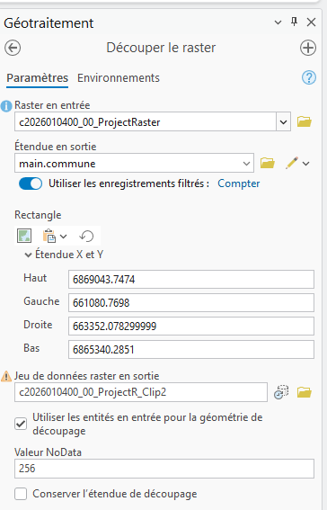
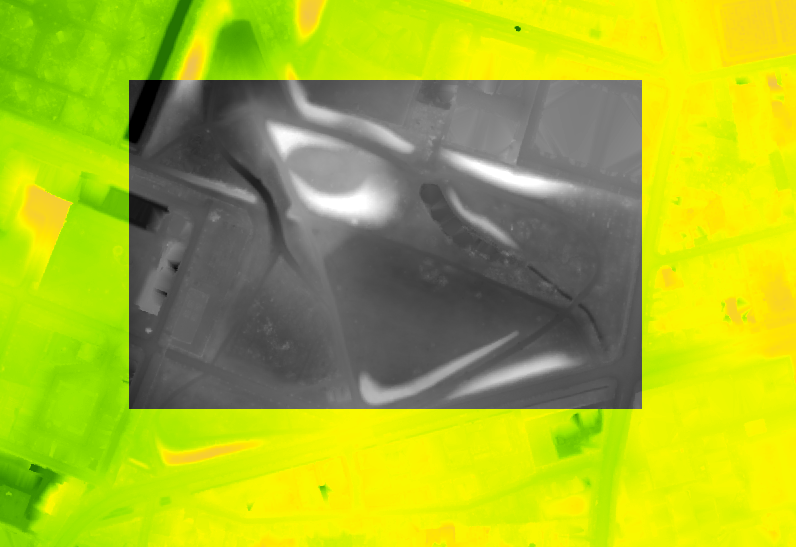
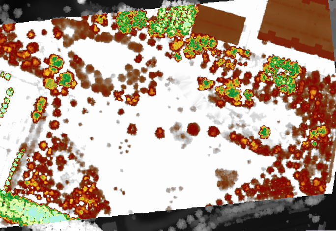
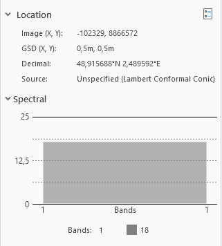
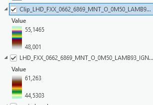
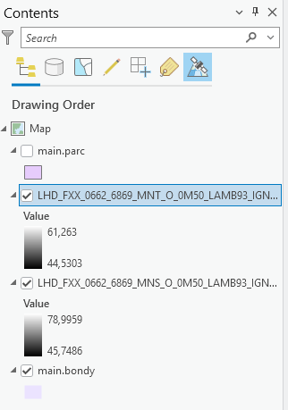

```{r setup, include=FALSE}
knitr::opts_chunk$set(echo = TRUE)
knitr::opts_chunk$set(cache = FALSE)
# Passer la valeur suivante à TRUE pour reproduire les extractions.
knitr::opts_chunk$set(eval = TRUE)
knitr::opts_chunk$set(warning = FALSE)
```

# Objet

Les images Sentinel de Copernicus Hub sont faciles d'accès et permettent d'évaluer les changements récents.

Pour le MNS et le MNT, la [campagne LIDAR de l'IGN](https://macarte.ign.fr/carte/mThSup/diffusionMNxLiDARHD) qui se termine actuellement a permis de récupérer des données beaucoup plus précises.

Le cours portera sur l'exploitation de cette donnée raster plus spécifique l'élévation. Nous explorerons la donnée, après l'avoir coupée, en la visualisant avec différentes symbologies.

Nous aborderons ensuite les opérations mathématiques simples possibles permises par la structure en raster.

Enfin, comme pour le 1er cours sur le raster, nous essaierons de construire une chaîne de géotraitement plutôt que d'explorer chaque outil un par un.

# Exploration

## Rechercher la donnée

Le mieux est de repérer les zones et de chercher les dalles sur cartes.gouv.fr. 2 liens utiles :

-   [la communauté lidar hd](https://geoservices.ign.fr/lidarhd)

-   [L'interface de téléchargement sur cartes.gouv](https://cartes.gouv.fr/telechargement/IGNF_MNT-LIDAR-HD)

Pour Bondy, par rapport aux zones de carreaux manquants, 2 zones concernées

```{r}
dir("data/cours5/", pattern = "tif$")
```

pour la ZAC (0661 / 6868)

```{r}
library(terra)
mnt <- rast("data/cours5/LHD_FXX_0661_6868_MNT_O_0M50_LAMB93_IGN69.tif")
plot(mnt)
mns <- rast("data/cours5/LHD_FXX_0661_6868_MNS_O_0M50_LAMB93_IGN69.tif")
plot(mns)
mnh <- mns-mnt
```

pour le parc (0662 / 6869)

D'après le nom du fichier, quelle est la précision ?

Charger les 2 dalles

Observer le poids

A t on besoin de reprojeter ?

## Couper au carreau manquant

Explorer le menu imagerie / processus et raster functions, quelle est la différence ?



### Sous R : carreau zac

Les carreaux sont en multipolygone, il faut les *éclater* en forçant le format polygone afin de retenir uniquement le carreau de la ZAC. C'est la commande *disagg*

```{r}
library(terra)
car <- vect("data/cours5.gpkg", "bondy")
car <- disagg(car)
# aire de chq carreau en hac
a <- round(expanse(car)/10000,0)
plot(car)
text(car, labels=a)
# on coupe le carreau 4
zac <- crop(mnh, car [4])
# parc <- crop(mnh, car [1])
```

```{r}
plot(zac)
```

## Symbologie

clic droit au niveau de la fenêtre contenu / symbologie

Rechercher la palette élévation dans le mode continu

Observer les différences avec l'image de départ





## Informations image



Prendre les arbres ou les bâtiments, trouver une fourchette de hauteurs.




Utiliser l'outil *statistiques zonales*

Refaire une symbologie

# Operations mathématiques base

## Calculatrice raster : calcul MNH



Voir la différence mnt, mns et mnh

```{r}
library(terra)
mnt <- rast("data/cours5/LHD_FXX_0661_6868_MNT_O_0M50_LAMB93_IGN69.tif")
plot(mnt)
mns <- rast("data/cours5/LHD_FXX_0661_6868_MNS_O_0M50_LAMB93_IGN69.tif")
plot(mns)
```

```{r}
mnh <- mns-mnt
plot(mnh)
```

## Histogramme

```{r}
options(scipen = 999)
hist(mns, col="wheat",  main= "MNS et MNT")
hist(mnt, add = T)
hist(mnh, main = "MNH")
```

# Une multitude d'outils

Il existe beaucoup d'outils, par exemple, pour un mnt, les outils traitant de la surface.


## Exemple d'utilisation de contour

L'outil sert à construire les courbes de niveau, mais il sert à autre chose ci-dessous.

```{r}
plot(zac)
contour(zac, col="red",add = T)
contour(zac, filled=T, nlevels = 5)
```

# Exercice : isoler les bâtiments et leur hauteur

Plus qu'une exploration exhaustive des outils existant, on cherche à raisonner sur une chaîne de traitement

Quel peut être la chaîne de géotraitement permettant de cartographier bâtiment et hauteur ?

Après avoir extrait la zone d'étude et construit un mnh, le traitement pourrait être le suivant :

-   classification sur la hauteur

-   OU densité de points

-   OU ré-échantillonner

-   seuillage (filtre)

-   tamisage (élimination des pixels isolés)

-   filtre morphologique : ajouter 2 pixels sur chaque ensemble de pixel

A chaque fois, il faut faire varier les paramètres pour voir si le résultat n'est pas plus intéressant.

## Reclassification

Il s'agit d'isoler les pixels entre 1 et 4 m.

```{r}
hist(zac)
reclassif <- matrix (c(-1,0,1,
                       1,4,2,
                       5,62,3),
                     ncol = 3,
                     byrow = TRUE)
zac2 <- classify(zac, rcl = reclassif)
pal <- c("blue", "white", "red")
plot(zac2, col = pal)
```

Affichage de chaque couche

```{r}
zac_by_class <- segregate(zac2, keep = T, other = NA, round=T)
plot(zac_by_class)
```

## Seuillage

Garder les pixels appartenant à la classe 2 uniquement

```{r}
zac3 <- clamp(zac2, lower = 2 , upper= 2.1, values=TRUE)
plot(zac3)
```

## Densité des points (cluster et kmeans)

Il s'agit d'utiliser l'algorithme du kmeans qui permet de regrouper les pixels en fonction de leur valeur.

Transformation de la donnée en tableau de chiffres

```{r}
df <- as.data.frame(zac, cell=T)
names(df)[2] <- "valeur"
```

Algo

```{r}
set.seed(99)
# centre des nuages de point
kmncluster <- kmeans(df[,-1], centers=10, iter.max = 500, nstart = 5, algorithm="Lloyd")
# on veut 10 clusters avec 500 iterations à partir de 5 pt au hasard
str(kmncluster)
```

9 éléments

la taille de chq groupe varie (size)

Retour au format géométrique

On ajoute l'identification du cluster au pixel

```{r}
kmr <- rast(zac, nlyr=1)
kmr [df$cell] <- kmncluster$cluster
kmr
```

```{r}
plot(zac, main = "Image de départ")
plot(kmr, main = "Classification non supervisée")
```

L'idée est définir plus de classes quitte à les fusionner ensuite.

## Ré échantillonage et vectorisation

Assembler les pixels en diminuant la résolution

```{r}
zaclowermodel <- zac2
res(zac2)
res(zaclowermodel) <- 1
zac4 <- resample(zac2, zaclowermodel, method = "near")
```

Puis vectoriser

```{r}
library(sf)
zac_poly <- as.polygons(zac4)
zac_poly <- st_as_sf(zac_poly)
zac_poly$cl <- zac_poly$LHD_FXX_0661_6868_MNS_O_0M50_LAMB93_IGN69
plot(zac_poly$geometry)
```

Filtrer à nouveau sur la classe

```{r}
zac_poly1 <- zac_poly [zac_poly$cl == 3,]
plot(zac_poly1$geometry)
```

## Tamisage

Les pixels sont plus gros, mais afin d'obtenir des polygones représentant des bâtiments, il faut agréger tous les petits polygones appartenant à la même classe.

```{r}
agg <- aggregate(zac_poly1, by = list(zac_poly1$cl), length)
agg <- st_cast(agg, "POLYGON")
plot(agg$geometry, main = "Agrégation des polygones")
```

Puis on mesure l'aire et on supprime les plus petits et le plus gros

```{r}
agg$aire <- st_area(agg)
hist(agg$aire)
```

```{r}
library(units)
agg$aire <- drop_units(agg$aire)
agg <- agg [agg$aire > 150 & agg$aire < 1600,]
```

```{r}
plot(zac4)
plot(agg$geometry)
```

## Simplification

```{r}
simpli5 <- st_simplify(agg, dTolerance=5)
simpli10 <- st_simplify(agg, dTolerance=10)
plot(simpli5$geometry)
plot(simpli10$geometry)

```

Comment récupérer la hauteur ?

Comment supprimer l'aire non construite ?
