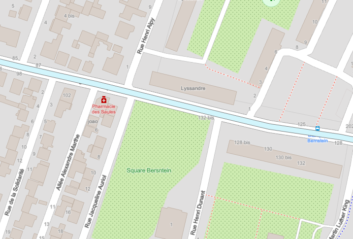
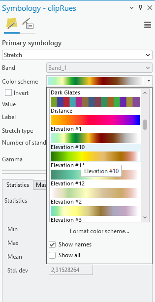
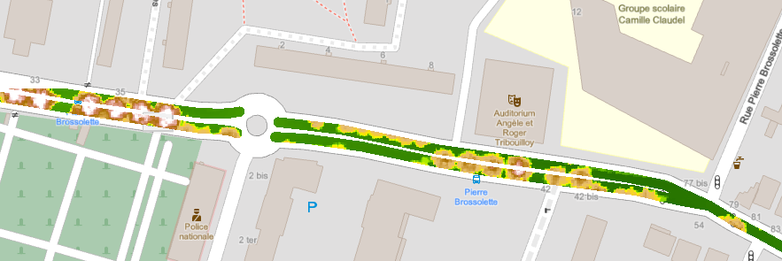
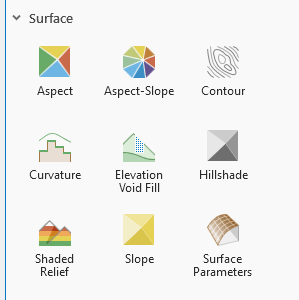
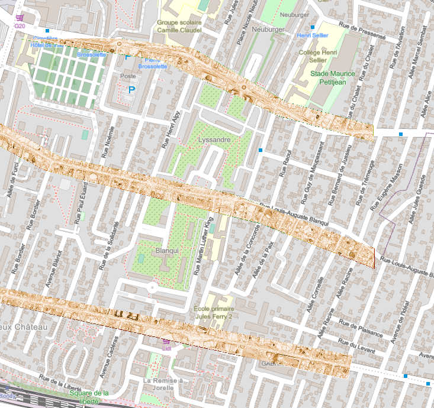

```{r setup, include=FALSE}
knitr::opts_chunk$set(echo = TRUE)
knitr::opts_chunk$set(cache = FALSE)
# Passer la valeur suivante à TRUE pour reproduire les extractions.
knitr::opts_chunk$set(eval = TRUE)
knitr::opts_chunk$set(warning = FALSE)
```

# Objet

Les images Sentinel sont faciles d'accès et permettent d'évaluer les changements récents.

Pour le MNS et le MNT, la [campagne LIDAR de l'IGN](https://macarte.ign.fr/carte/mThSup/diffusionMNxLiDARHD) qui se termine actuellement a permis de récupérer des données beaucoup plus précises.

Concernant notre problématique spécifique (richesse / pauvreté commune et administrés), l'idée est d'examniner les mnt / mns de 3 rues importantes de votre commune (pas de départementale), pour voir si la voirie est lisse (= sans nid de poule).

Le MNT issu du Lidar permet-il de repérer les problèmes voirie ?

# Définitions MNS MNT MNE

Différence entre un MNT / MNS et une image Sentinel ?

Directive européenne INSPIRE

-   MNT surface nue

-   MNS hauteur de tous les objets placés au sol (sursol)

-   un MNE correspond soit au MNT, soit au MNS

Dans chaque cas, il faut s'interroger.

Charger les dalles correspondant à vos rues

-   [MNT](https://cartes.gouv.fr/telechargement/IGNF_MNT-LIDAR-HD)

-   [MNS](https://cartes.gouv.fr/telechargement/IGNF_MNS-LIDAR-HD)

Pour Bondy, les 3 rues sont sur 1 seule dalle (662 / 6867)

```{r}
dir("data/cours5/", pattern = "6867")
library(terra)
mns <- rast("data/cours5/LHD_FXX_0662_6867_MNS_O_0M50_LAMB93_IGN69.tif")
mnt <- rast("data/cours5/LHD_FXX_0662_6867_MNT_O_0M50_LAMB93_IGN69.tif")
```

-   D'après le nom du fichier, quelle est la précision ?

# Récupérer les rues

Récupérer les rues concernées avec overpass turbo, le tag est

```         
(name ~ "anqui" or name ~ "ard Vaillant"  or name ~ "arbusse") and highway <> bus_stop and highway = * in bondy
```

A commenter

-   le tilde,

-   la casse

-   les opérateurs OR et AND

-   les parenthèses

# Couper au tampon

## Tampon le plus petit possible

Quelle est la largeur d'une chaussée ?

```{r}
library(sf)
rue <- st_read("data/cours5/3rues.geojson", quiet = T)
# agréger les géométries par rues
rue <- aggregate(rue [, "name"], by = list(rue$name), length)
rue <- st_transform(rue, 2154)
tampon <- st_buffer(rue,2)
names(tampon) [1:2] <- c("nom", "nb")
library(mapview)
mapview(tampon)
st_write(tampon, "data/cours5.gpkg", "tampon", delete_layer = T, quiet = T)
```



## Couper (= crop / mask)

Pour couper, explorer le menu imagerie / processus et raster functions, quelle est la différence ?

Dans fonctions rasters, tout est dans gestion des données

```{r}
MNT <- crop(mnt, tampon, mask=T)
MNS <- crop(mns, tampon, mask=T)
```

```{r}
plot(MNT)
```

paramètres à appliquer :

-   ne pas oublier de cocher "couper la géométrie" sinon la coupure se fait par défaut au carré.

Dans Arcgis, ne pas oublier de cocher "couper la géométrie" sinon la coupure se fait par défaut au carré

# Symbologie

clic droit au niveau de la fenêtre contenu / symbologie



Rechercher la palette élévation dans le mode continu, appliquer la même palette aux deux couches

Observer les différences entre les 3 rues au niveau du mnt et du mns

## Statistiques

Quelle différence dans les étendues min / max ?

```{r}
freqMNS <- freq(MNS)
freqMNT <- freq(MNT)
head(freqMNT)
par(mf_row = c(1,2))
barplot(MNT, main = "MNT")
barplot(MNS, main = "MNS")
```

Dans Arcgis, explorer l'outil *informations image*

## La question !

Et surtout peut-on déjà supposer que la route n'est pas totalement lisse ?



# MNH : utilisation de la calculatrice raster

Retenir la notion d'algèbre des cartes

Afin d'éliminer le problème de différence d'élévation entre les 3 rues, on va créer un MNH.

```{r}
MNH <- MNS - MNT 
#writeRaster(MNH, "data/cours5/mnh.tif", overwrite = T)
```

# Tester les modes de visualisation

Les rasters d'élévations sont toujours utilisés avec les mêmes outils :

 

Essayer notamment ombrage, pente et contour.

```{r}
# utilisation du contour
contour(MNH, col = "red", border=NA)
# taille pente (en degrés) et exposition
pente <- terrain(MNH, v = c("slope", "aspect"), unit ="degrees")
ombrage <- shade(slope = pente$slope, aspect = pente$aspect)
plot(ombrage, col = gray (0:50/50),legend = F)
```

Il apparaît très facile avec les différents outils proposés de cerner les anomalies de la voirie.

# Dénombrer le nombre d'anomalies par rue

Reprendre par exemple la couche pente.

Proposition d'une méthode :

-   lissage

On agrège les pixels à leurs voisins selon la valeur.

```{r}
lissage <- focal(pente, w=3, fun = mean, nar.rm=T)
plot(lissage)
```

-   seuillage (reclassification) : distinguer les pentes \> 30 des autres

```{r}
lissage <- focal(pente, w=3, fun = mean, nar.rm=T)
hist(lissage)
reclassif <- matrix (c(0,5,1,
                       5,83,2),
                     ncol = 3,
                     byrow = TRUE)
lissage2 <- classify(lissage, rcl = reclassif)
pal <- c("white", "blue")
plot(lissage2, col = pal)
freq(lissage2)
```

-   Convertir raster =\> vecteur et agréger les polygones contigus

```{r}
library(sf)
v <- as.polygons(lissage2)
v <- st_as_sf(v)
v <- st_cast(v, "POLYGON")
table(v$slope)
v <- v [v$slope == 2,]
mapview(v)
```

-   Comter le nombre de géométries et leur taille

```{r}
v$aire <- st_area(v)
hist(v$aire)
library(mapsf)
mf_init(v [1:10,])
mf_map(v, "aire", type ="choro", add = T)
```

Une vérification sur le terrain s'impose bien sûr !
