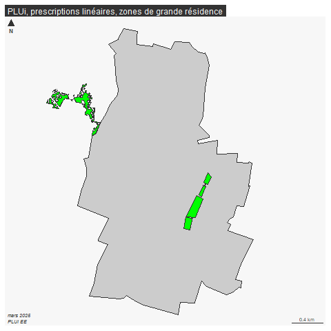
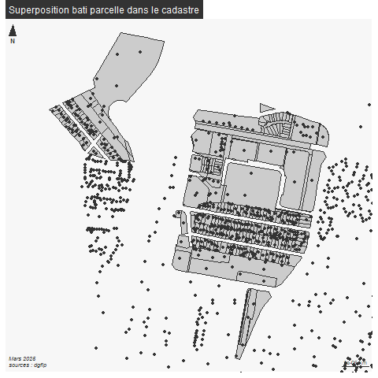

```{r setup, include=FALSE}
<<<<<<< HEAD
knitr::opts_chunk$set(eval  = FALSE)
knitr::opts_chunk$set(eval  = TRUE)
=======
>>>>>>> dca2a4220391f135546b0ccf47e5c0110be5fa59
knitr::opts_chunk$set(eval  = TRUE)
knitr::opts_chunk$set(echo  = TRUE)
knitr::opts_chunk$set(warning  = FALSE)
``` 


```{r}
library(sf)
library(mapsf)
```


# Exploration de la donnée : le PLUi

Exercice : introduire les commentaires de ce code

```{r}
ville <- st_read("data/gros/ADMIN-EXPRESS-COG_2-1__SHP__FRA_2020-11-20/ADMIN-EXPRESS-COG/1_DONNEES_LIVRAISON_2020-11-20/ADE-COG_2-1_SHP_WGS84G_FRA/COMMUNE.shp")
bondy <- ville [ville$NOM_COM == 'Bondy',]
bondy <- st_transform(bondy, 2154)
st_layers("data/construction.gpkg")
prescriptionLIN <- st_read("data/gros/PLUi_Bondy/200057875_PRESCRIPTION_LIN_20210629.shp")
unique(prescriptionLIN$LIBELLE)
prescriptionSURF <- st_read("data/gros/PLUi_Bondy/200057875_PRESCRIPTION_SURF_20210629.shp")
unique(prescriptionSURF$LIBELLE)
residence <- prescriptionSURF [prescriptionSURF$LIBELLE == 'Espace paysager protege de grandes residences',]
<<<<<<< HEAD
png("img/pluiResidence.png")
mf_map(bondy)
mf_map(residence, col="green", add = T)
mf_layout("PLUi, prescriptions linéaires, zones de grande résidence", "mars 2025\nPLUi EE")
dev.off()
```


=======
>>>>>>> dca2a4220391f135546b0ccf47e5c0110be5fa59
mf_map(bondy)
mf_map(residence, col="green", add = T)
```


# Construction d'un indicateur

## Exemple ration bati / parcelle

<<<<<<< HEAD


```{r}
# chargement des donnéees
parcelle <- st_read("data/cadastre-93010-parcelles.json")
bat <- st_read("data/gros/cadastre-93-batiments.json")
batSel <- bat  [bat$commune == 93010,]
# exploration des couches
names(bat)
names(parcelle)
```

### L'intersection spatiale (ou jointure spatiale)

```{r}
inter <- st_intersection(parcelle, batSel)
```

L'intersection est un processus trop coûteux en mémoire (dommage, il est simple).
Regarder au niveau de la mémoire utilisée.

```{r}
# Libérer la mémoire
rm(bat)
gc()
```

Pour stopper l'exécution, bouton rouge

source sur la gestion de la mémoire dans R. Regarder le volet des données.

On a plusieurs solutions


#### Utilisation des centroides et filtre sur la zone A du cadastre


```{r}
batSel$aireBat <- st_area(batSel$geometry)
parcelle <- parcelle [parcelle$section == 'A',]
batSel <- st_centroid(batSel)
png("img/batParcelle.png")
mf_map(parcelle)
mf_map(batSel, add = T)
mf_layout("Superposition bati parcelle dans le cadastre", "Mars 2025\nsources : dgfip")
dev.off()
```




```{r}
inter <- st_intersection(parcelle, bat)
```

Cela ne fonctionne toujours pas. A explorer.

### Calcul du ratio et carte
=======
=======
>>>>>>> dca2a4220391f135546b0ccf47e5c0110be5fa59
=======
>>>>>>> dca2a4220391f135546b0ccf47e5c0110be5fa59
```{r}
parcelle <- st_read("data/cadastre-93010-parcelles.json")
bat <- st_read("data/gros/cadastre-93-batiments.json")
bat <- bat  [bat$commune == 93010,]
names(bat)
names(parcelle)
inter <- st_intersection(parcelle, bat)
```

Utilisation des centroides


```{r}
bat$aireBat <- st_area(bat$geometry)
parcelle <- parcelle [parcelle$section == 'A',]
bat <- st_centroid(bat)
inter <- st_intersection(parcelle, bat)

```

Calcul du ratio et carte


<<<<<<< HEAD

=======
>>>>>>> dca2a4220391f135546b0ccf47e5c0110be5fa59
```{r}
inter$ratio <- inter$aire / st_area(inter$geometry)
mf_map(inter, type = "choro", var = "ratio", breaks = c(0,30, 70))
```


<<<<<<< HEAD

### Analyse de la carte

=======
Analyse de la carte
>>>>>>> dca2a4220391f135546b0ccf47e5c0110be5fa59

Le rapport entre la surface de la parcelle et son bâti fait partie de l'indicateur de
dureté foncière.
Sur Bondy, les zones de grandes résidences ressortent clairement par rapport aux zones
pavillonnaires.


