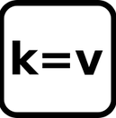

```{r setup, include=FALSE}
knitr::opts_chunk$set(echo = TRUE)
knitr::opts_chunk$set(cache = TRUE)
# Passer la valeur suivante à TRUE pour reproduire les extractions.
knitr::opts_chunk$set(eval = TRUE)
knitr::opts_chunk$set(warning = FALSE)
```

# Objet

Initiation à la saisie sous OSM

# Outils OSM

- la carte

https://www.openstreetmap.org/#map=17/48.46338/2.32729

- l'extracteur : overpass turbo

https://overpass-turbo.eu/

- les informations : le wiki ou taginfo

https://taginfo.openstreetmap.org/

https://wiki.openstreetmap.org/wiki/Main_Page


- la qualité de la donnée

https://resultmaps.neis-one.org/


# Le tag





# Exercices


- Faire une saisie sur un territoire que vous connaissez

- Trouver le tag pour bureau de vote et faire l'extraction et la cartographie


