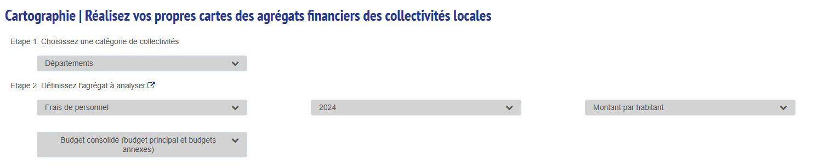
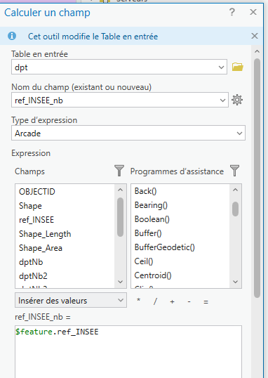
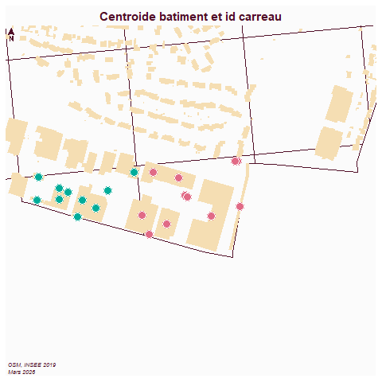
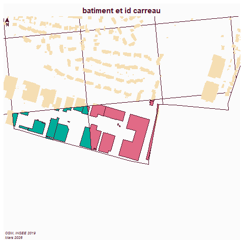

```{r setup, include=FALSE}
knitr::opts_chunk$set(echo = TRUE)
knitr::opts_chunk$set(cache = FALSE)
# Passer la valeur suivante à TRUE pour reproduire les extractions.
knitr::opts_chunk$set(eval = TRUE)
knitr::opts_chunk$set(warning = FALSE)
```

# Objet

Les jointures permettent d'enrichir les données en liant plusieurs tables ensemble. Les attributs des 2 tables vont se retrouver dans la jointure.

La jointure attributaire est facile à comprendre. 
Le point de vigilance est de vérifier :

- le nombre d'entités au départ 

- et après la jointure 


La jointure spatiale est plus complexe et coûteuse en terme de calculs, se méfier notamment des croisements polygones / polygones, il vaut mieux passer par les centroides.

Les jointures spatiales reposent sur les relations topologique (inclusion, adjacence et intersection).

# Jointure attributaire

Vu la sélection attributaire, 

A voir, l'ensemble de définition sur une seule couche.

## Repérer la clé

Simplicité de la clé (éviter les noms, privilégier les chiffres)

Cas des noms de rue

## Sens de la jointure

Table avec géométrie en premier

## Exemple données OFGL et communes du dpt

```{mermaid}
flowchart LR
  A[géométrie commune] --> C{joindre}
  B[chiffres ofgl] --> C{joindre}
  C --> D[carte symbologie graduée]
```


### OSM

Récupération des limites communales dans le dpt dans OSM

requête : admin_level=8 in 93

```{r}
library(sf)
library(mapsf)
commune <- st_read("data/cours6/communes93.geojson", quiet=T)
# Extraction uniquement des polygones
commune <- st_collection_extract(commune, "POLYGON")
```


### OFGL




```{r}
ofgl <- read.csv2("data/cours6/donnees_carto_communes.csv", dec =".")
```

### La clé


```{r}
commune$ref.INSEE
ofgl$Insee
```
Dans Arcgis, la jointure ne passera pas.

Il faut convertir le code insee en chiffre.




### La jointure

```{r}
jointure <- merge(commune, ofgl, by.x = "ref.INSEE", by.y = "Insee")
```

Avec Arcgis, on utilise le menu *Jointure et relation* du clic droit sur la couche


```{r}
hist(jointure$Montant.par.habitant.2024)
mf_map(jointure, type = "choro", var = "Montant.par.habitant.2024", border = NA)
#mf_label(jointure, "name" , overlap = F, halo = T)
mf_layout("Dépenses personnel par habitant dans le 93", "OFGL 2024, OSM 2026")
```

Sous Arcgis, faire une symbologie *couleurs gradués*

# Jointure spatiale


```{mermaid}
flowchart LR
  A[carreau] --> C{intersecter}
  B[bat] --> C{intersecter}
  C --> D[bat avec l'identifiant du carreau]
```

Pas de champs attributaire commun entre les 2 géométries, il faut se servir de la topologie.

Attention aux statistiques issues de ces jointures !

L'idée est de compter le nombre de bâtiments par carreau afin de calculer les données filosofi au bâtiment.

La récupération des bâtiments se fait sur overpass turbo : *building=yes in bondy*


```{r}
car <- st_read("data/dataCours1/car.gpkg", quiet = T)
bat <- st_read("data/cours6/bat.geojson", quiet=T)
```


Quelles sont les projections ?


```{r}
bat <- st_transform(bat, 2154)
```


Affichage des données


```{r}
mf_map(car [car$id == 93010,], col=NA)
mf_map(bat, col = "cadetblue", border=NA,add = T)
mf_layout("Carreaux et bâtiments", "Filosofi 2019 / OSM 2026")
```


Les jointures spatiales peuvent être coûteuses en calcul, du coup, souvent, on utilise les centroides.

Il est plus facile pour les logiciels de calculer une intersection centroide / polygone que polygone / polygone.

## Points et polygones

### Batiments (centroides) et carreau


```{r}
library(sf)
bat <- st_read("data/cours6/bat.geojson", quiet=T)
bat <- st_transform(bat, 2154)
car <- st_read("data/bondy.gpkg", "carreau", quiet=T)
car <- car [, c("idcar_200m")]
car <- car [!duplicated(car),]
car$id <- seq(1, length(car$idcar_200m))
car <- st_collection_extract(car, "POLYGON")
```

```{r}
library (mapsf)
mf_map(car)
mf_label(car, "id", cex = 0.5)
```

```{r}
# centroides bat
centroid <- st_centroid(bat$geometry)
centroid <- st_transform(centroid, 2154)
car <- st_transform(car, 2154)
# intersection : c'est la relation topologique passe partout
jointure <- st_intersection(car, centroid)
```


```{r}
head(table(jointure$id))
jointure <- jointure [jointure$id < 3,]
```


```{r, eval=FALSE}
png("img/jointureSpatiale1.png")
mf_init(car [1:3,])
mf_map(car, ,col = NA, add = T)
mf_map(bat, col = "wheat", border=NA, add= T)
mf_map(jointure, type="typo", var="id", pch=21, add = T, leg_pos = NA)
mf_layout("Centroide batiment et id carreau", "OSM, INSEE 2019\nMars 2026")
dev.off()
```


## Polygones et polygones

bat et carreaux

```{r}
jointure2 <- NULL
jointure2 <-  st_intersection(car, bat)
```


```{r, eval=FALSE}
jointure <- jointure2
jointure <- jointure [jointure$id < 3,]
png("img/jointureSpatiale2.png")
mf_init(car [1:3,])
mf_map(car, ,col = NA, add = T)
mf_map(bat, col = "wheat", border=NA, add= T)
mf_map(jointure [jointure], type="typo", var="id", pch=21, add = T, leg_pos = NA)
mf_layout("batiment et id carreau", "OSM, INSEE 2019\nMars 2026")
dev.off()
```




## Calcul statistique à effectuer

Dans Arcgis Pro, trouver comment calculer le nombre de bâtiments par carreaux (centroides et polygones)
