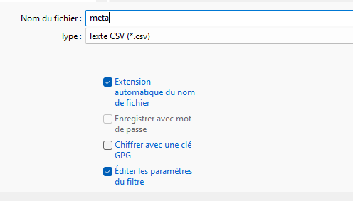
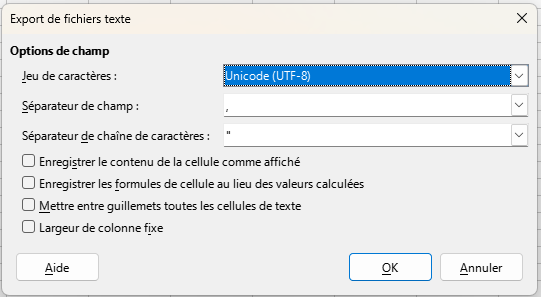

```{r setup, include=FALSE}
knitr::opts_chunk$set(echo = TRUE)
knitr::opts_chunk$set(cache = TRUE)
# Passer la valeur suivante à TRUE pour reproduire les extractions.
knitr::opts_chunk$set(eval = TRUE)
knitr::opts_chunk$set(warning = FALSE)
```

# Objet

Créer un fichier .csv décrivant les métadonnées du projet, l'afficher avec la commande
*knitr::kable*

# Créer le csv

Avec libre office de préférence, l'encodage et l'enregistrement sont plus faciles.

Au moment de l'enregistrement, côcher 





# Lire un csv


```{r}
meta <- read.csv("data/meta.csv", fileEncoding = "UTF-8")
meta
knitr::kable(meta)
```


