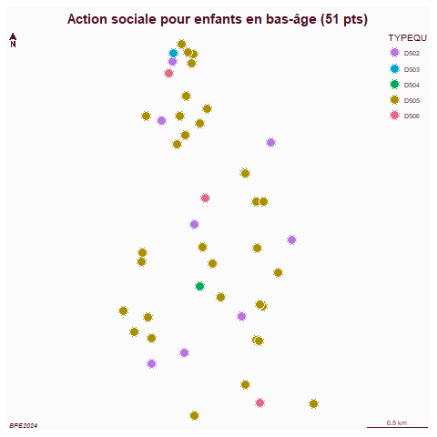
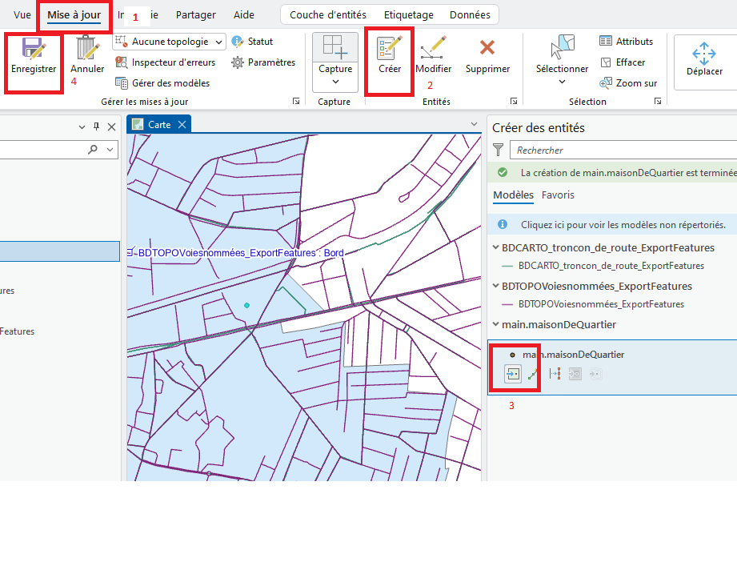
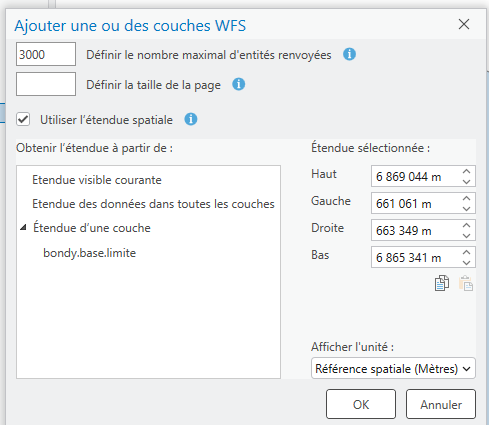

```{r setup, include=FALSE}
knitr::opts_chunk$set(echo = TRUE)
knitr::opts_chunk$set(cache = FALSE)
# Passer la valeur suivante à TRUE pour reproduire les extractions.
knitr::opts_chunk$set(eval = TRUE)
knitr::opts_chunk$set(warning = FALSE)
```

# Objet

Au niveau d'Arcgis, c'est la barre d'outils *network analyst*


La distance est une composante essentielle en géographie, notamment car elle mène à l'analyse spatiale qui peut être considérée comme une autre famille de traitements spatiaux.

Plutôt que de passer en revue tous les outils (cf TD groupe 3), l'idée est d'évoquer

-   un traitement simple : les aires d'influence

-   un traitement plus complexe : une analyse d'accessibilité

Cela permet d'utiliser

-   la distance à vol d'oiseau (= euclidienne)

-   et la distance basée sur un réseau

# Donnée : utilisation de la BPE

Il faut avoir un ensemble de points autour desquels, au niveau de la communal, calculer les aires d'influence et l'accessibilité.

Il serait intéressant de récupérer les réseaux des maisons de quartier.

```         
amenity=community-centre in bondy
```

```{r, eval=FALSE}
library(sf)
data <- st_read("data/cours7/export.geojson", quiet = T)
data <- st_centroid(data)
data <- st_transform(data, 2154)
commune <- st_read("data/bondy.gpkg", "commune")
st_write(data [,"name"],"data/cours7.gpkg", "maisonDeQuartier", quiet = T, delete_layer = T)
```

Mais de tels équipements n'existent pas dans toutes les communes.

C'est pouquoi on télécharge la BPE2024, et on extrait tous les équipements de la catégorie *Action sociale pour enfants en bas-âge* (D5) dans laquelle est la catégorie *centres sociaux*

```{r, eval=FALSE}
download.file("https://www.insee.fr/fr/statistiques/fichier/8217525/BPE24.zip", "data/gros/BPE24.zip")
unzip("data/gros/BPE24.zip", exdir = "data/gros")
bpe <- read.csv2("data/gros/BPE24.csv", dec=".")
choix <- read.table("data/choix.csv")
choix <- choix$V1
# filtre sur la commune et la catégorie
bpe2 <- bpe [bpe$DEPCOM %in% choix & bpe$SDOM == 'D5',]
bpe2 <- bpe2 [!is.na(bpe2$LAMBERT_X), ]
bpe2 <- st_as_sf(bpe2, coords = c("LAMBERT_X", "LAMBERT_Y"), crs = 2154)
st_write(bpe2 [,c("NOMRS","TYPEQU", "DEPCOM")], "data/cours7.gpkg", "bpe", quiet = T, delete_layer = T)
table(bpe2$DEPCOM)
```

```{r, eval=FALSE}
# ex Bondy
sel <- bpe2 [bpe2$DEPCOM == 93010,]
table(sel$TYPEQU)
png("img/bpeBondy.png")
mf_map(sel, type = "typo", var = "TYPEQU")
mf_layout("Action sociale pour enfants en bas-âge (51 pts)", "BPE2024")
dev.off()
```



[liste des codes](https://www.insee.fr/fr/metadonnees/source/fichier/BPE24_liste_hierarchisee_TYPEQU.html) et nb d'établissements pour Bondy

D502 ÉTABLISSEMENT D’ACCUEIL DU JEUNE ENFANT (11)

D503 LIEUX D’ACCUEIL ENFANT-PARENT (1)

D504 RELAIS PETITE ENFANCE (1)

D505 ACCUEIL DE LOISIR SANS HÉBERGEMENT (35)

D506 CENTRES SOCIAUX (3)

D507 MÉDIATION FAMILIALE (0)

# Aire d'attraction

A savoir :

-   Distance euclidienne et non réseau

-   Polygones de Thiessen, triangulation de Delaunay.

Tout résident dans le polygone ira vers l'équipement.

```{r}
library(sf)
data <- st_read("data/cours7.gpkg", "maisonDeQuartier", quiet = T)
v <- st_voronoi(st_union(data))
v <- st_collection_extract(v,"POLYGON")
plot(v)
```

```{r}
library(mapsf)
commune <- st_read("data/bondy.gpkg", "commune", quiet=T)
mf_map(commune)
mf_map(data, col="red", add = T)
mf_map(v, add = T, col = NA)
mf_layout("Aires d'influence des maisons de Quartier", "OSM\nMars 2025")
```

Faire l'opération dans Arcgis. Que se passe-t-il ?

Pour éviter que l'opération ne couvre pas la commune, placer 4 points déterminant la bbox. (se référer à la procédure *Comment créer des entités* dans les généralités du moodle)




# Accessibilité (= isochrone)

## Nécessité d'un réseau topologique sous Arcgis

### La démarche

La mise en place du réseau sous Arcgis se fait en différentes étapes :

-   création du *jeu* de classes d'entités dans la gdb (au niveau de la gdb, nouveau / jeu de classes d'entité)

-   importation de la *classe* d'entité shape issue de la BD TOPO (au niveau du jeu, importer / cl d'entité)

-   création du *jeu de données réseau* (outil créer un jeu de données réseau / pas d'altitude, la cible est le jeu défini au départ)

### La donnée : BD TOPO

Cette opération est complexe notamment car la récupération du réseau de la [BD TOPO](https://geoservices.ign.fr/bdtopo) représente des gros volumes de données.

- 1,69 G° pour l'ensemble du gpkg pour le 93

```{r, eval=FALSE}
library(sf)
couches <- st_layers("data/gros/BDT_3-5_GPKG_LAMB93_D093-ED2025-12-15.gpkg")
couches <- couches$name
data <- st_read("data/gros/BDT_3-5_GPKG_LAMB93_D093-ED2025-12-15.gpkg", "route_numerotee_ou_nommee")
st_write(data,"data/cours7/route.gpkg", "bdtopo")
```
- 6 M° pour l'extraction des petites routes

## La solution : le flux WFS

Heureusement il existe des [flux WFS](https://geoservices.ign.fr/documentation/services/utilisation-sig/tutoriel-arcgis/wfs)

Le flux est utile à partir d'une échelle au 1/25 0000e.

Dans Arcgis, charger la couche de la commune, cliquer glisser sur l'espace carte, ne pas oublier de côcher étendue de la couche.

 Les deux couches sont :

-   tronçons de route (les routes principales)

-   voies nommées (les routes internes à la commune)

Ce jeu de données peut servir de base au réseau et aux différentes propositions du TD groupe 3.

En TD, nous essaierons juste de créer le réseau à partir de la couche *tronçons de route*

Il existe également une alternative plus simple.

## Les API de l'IGN et le nouveau Géoportail (Cartes.gouv)

Aujourd'hui, l'IGN met à disposition des outils qui permettent de faire des itinéraires ou des traitements autour des distances par le biais d'API. Tout se passe au niveau de Carte.gouv, le remplaçant du Géoportail.

[Faire des isochrones avec l'IGN](https://cartes.gouv.fr/aide/fr/guides-utilisateur/visualiseur-cartographique/les-outils-autour-de-la-carte/calculer-une-isochrone/)

Pour le TD, créer quelques isochrones avec cet outil et les importer dans Arcgis.

## R : obtenir un ensemble d'isochrones basé sur l'API

Sous R, on utilise une librairie qui permet d'avoir une syntaxe simple de cette API. On peut ainsi reprendre le fichier des maisons de quartier et obtenir les isochrones.

```{r}
data <- st_read("data/cours7.gpkg", "maisonDeQuartier", quiet = T)
library(rgeoservices)
data <- st_transform(data, 4326)
accessibilite <- NULL
nom <- NULL
i <- 1
for (i in c(1:length(data$geom))){
  pt <- unlist(data$geom  [i])
longitude <- pt [1]
latitude <- pt [2]
tmp <- gs_get_isochrone(
  longitude,
  latitude,
  cost_value = 10,
  profile = "pedestrian",
  direction = "departure",
  time_unit = "minute"
)
tmpN <- data$name [i]
accessibilite <- rbind(tmp, accessibilite)
nom <- c(tmpN, nom)
}
accessibilite$nom <- nom
```

```{r}
commune <- st_transform(commune, 4326)
mf_map(commune)
mf_map(data, col = "red", add = T)
mf_map(accessibilite, type="typo", var = "nom", add = T, alpha = 0.5, border = NA, leg_pos=NA)
mf_layout("Isochrones 10 mn à pied autour des Maisons de Quartier", "librairie rgeoservices\nMars 2026")
```
