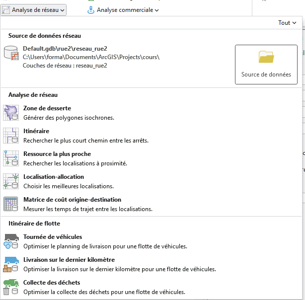

```{r setup, include=FALSE}
knitr::opts_chunk$set(echo = TRUE)
knitr::opts_chunk$set(cache = FALSE)
# Passer la valeur suivante à TRUE pour reproduire les extractions.
knitr::opts_chunk$set(eval = TRUE)
knitr::opts_chunk$set(warning = FALSE)
```

# Objet


Au niveau d'Arcgis, c'est la barre d'outils *network analyst*



La distance est une composante essentielle en géographie, notamment car elle mène
à l'analyse spatiale qui peut être considérée comme une autre famille de traitements
spatiaux.

Plutôt que de passer en revue tous les outils (cf TD groupe 3), l'idée est d'évoquer 

- un traitement simple : les aires d'influence

- un traitement plus complexe : une analyse d'accessibilité

Cela permet d'utiliser 

- la distance à vol d'oiseau (= euclidienne) 

- et la distance basée sur un réseau.

# Donnée

Il faut avoir un ensemble de points autour desquels, au niveau de la communal, des aires 
d'influence et l'accessibilité.

Il serait intéressant de récupérer les réseaux des maisons de quartier.

```{}
amenity=community-centre in bondy
```


```{r, eval=FALSE}
library(sf)
data <- st_read("data/cours7/export.geojson")
data <- st_centroid(data)
data <- st_transform(data, 2154)
commune <- st_read("data/bondy.gpkg", "commune")
st_write(data [,"name"],"data/cours7.gpkg", "maisonDeQuartier", quiet = T, delete_layer = T)
```


Mais de tels équipements n'existent pas dans toutes les communes.


C'est pouquoi on télécharge la BPE2024, et on extrait tous les équipements culturels


```{r, eval=FALSE}
library(archive)
archive_extract("data/gros/BPE24.zip", dir="data/gros")
bpe <- read.csv2("data/gros/BPE24.csv", dec=".")
choix <- read.table("data/choix.csv")
choix <- choix$V1
bpe2 <- bpe [bpe$DEPCOM %in% choix & bpe$DOM == 'F',]
bpe2 <- bpe2 [!is.na(bpe2$LAMBERT_X), ]
bpe2 <- st_as_sf(bpe2, coords = c("LAMBERT_X", "LAMBERT_Y"), crs = 2154)
st_write(bpe2, "data/cours7.gpkg", "bpe", quiet = T, delete_layer = T)
```


# Aire d'attraction


Distance euclidienne et non réseau


Polygones de Thiessen, triangulation de Delaunay


Tout résident dans le polygone ira vers l'équipement.


```{r}
library(sf)
data <- st_read("data/cours7.gpkg", "maisonDeQuartier")
v <- st_voronoi(st_union(data))
v <- st_collection_extract(v,"POLYGON")
plot(v)
```


```{r}
library(mapsf)
commune <- st_read("data/bondy.gpkg", "commune")
mf_map(commune)
mf_map(data, col="red", add = T)
mf_map(v, add = T, col = NA)
mf_layout("Aires d'influence des maisons de Quartier", "OSM\nMars 2025")
```

Faire l'opération dans Arcgis.
Pour éviter que l'opération ne couvre pas la commune, placer 4 points déterminant la bbox.


# Accessibilité (= isochrone)

Arcgis n'est pas le seul outil possible.

## IGN

[Faire des isochrones avec l'IGN](https://cartes.gouv.fr/aide/fr/guides-utilisateur/visualiseur-cartographique/les-outils-autour-de-la-carte/calculer-une-isochrone/)

Pour le TD, créer quelques isochrones avec cet outil et les importer dans Arcgis.

## R

Sous R, on utilise une librairie qui permet d'avoir une syntaxe simple.

```{r}
library(rgeoservices)
data <- st_transform(data, 4326)
length(data$geom)
accessibilite <- NULL
nom <- NULL
for (i in c(1:length(data$geom))){
  pt <- unlist(data$geom  [i])
longitude <- pt [1]
latitude <- pt [2]
tmp <- gs_get_isochrone(
  longitude,
  latitude,
  cost_value = 10,
  profile = "pedestrian",
  direction = "departure",
  time_unit = "minute"
)
tmpN <- data$name [i]
accessibilite <- rbind(tmp, accessibilite)
nom <- c(tmpN, nom)
}
accessibilite$nom <- nom
```


```{r}
commune <- st_transform(commune, 4326)
mf_map(commune)
mf_map(data, col = "red", add = T)
mf_map(accessibilite, type="typo", var = "nom", add = T, alpha = 0.5, border = NA, leg_pos=NA)
mf_layout("Isochrones 10 mn à pied autour des Maisons de Quartier", "librairie rgeoservices")
```


