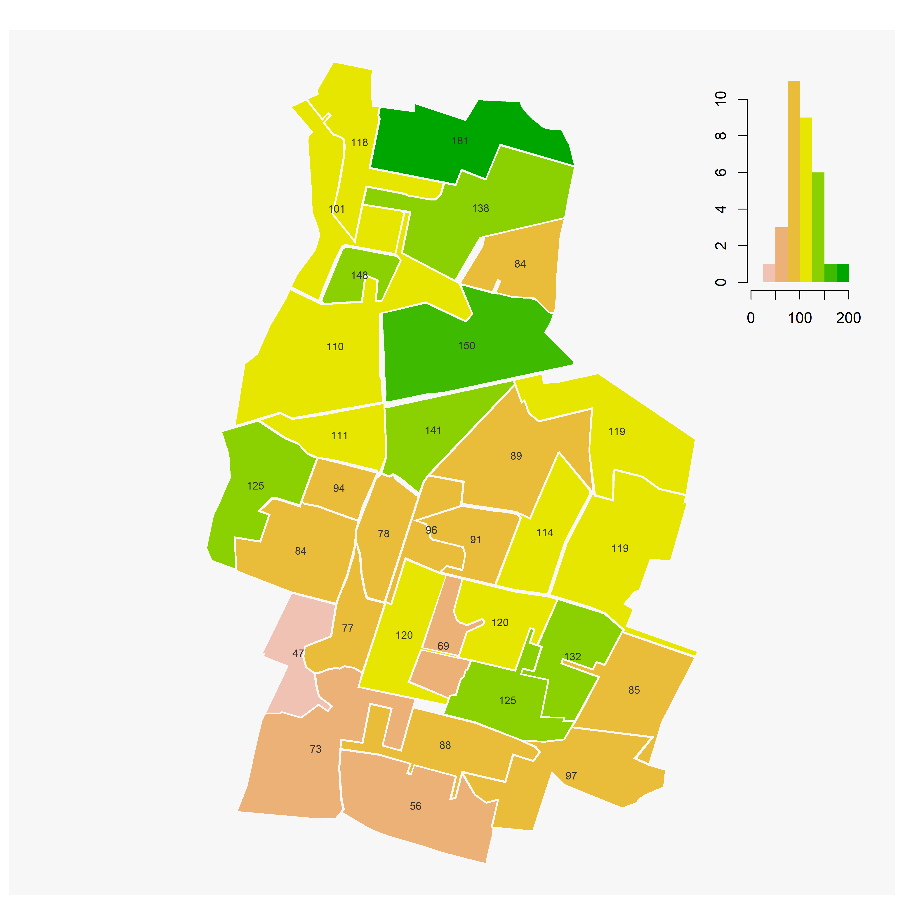

```{r setup, include=FALSE}
knitr::opts_chunk$set(echo = TRUE)
knitr::opts_chunk$set(cache = TRUE)
# Passer la valeur suivante à TRUE pour reproduire les extractions.
knitr::opts_chunk$set(eval = TRUE)
knitr::opts_chunk$set(warning = FALSE)
```


# Sémiologie

## Une définition rapide

Un ensemble standardisés de règle dont ...

### Première règle de sémiologie

https://neocarto.hypotheses.org/5717


### La cheatsheet du package mapsf


Cette cheatsheet pe Illustrationrmet de cataloguer toutes les cartes possibles.

## Illustration

### Reprise des données sur le nombre de ménages

```{r}
library(sf)
data <- st_read("data/vote.gpkg", "inseeBondy")
```

24 variables disponibles, on prend celui du nombre de ménages pauvres.


### Discrétisation : étudier sa distribution


```{r}
summary(data$Men_pauv)
# Le maximum est très éloigné du 3e quartile !
hist(data$Men_pauv, breaks = c(0,5,10,20,40,200,300))
```

Cette distribution permet de distinguer dans le groupe des très pauvres les différentes catégories.

### Cartographie

Comment rendre cette distribution très inégale ?

L'usage d'une palette différente peut-être une solution.

```{r}
library(mapsf)
paliers <- c(0,5,10,20,40,100,200,300)
palette <- mf_get_pal(n = c(5,2), pal = c("Mint", "Burg"))
mf_map(data, type ="choro", var = "Men_pauv", breaks = paliers, paliers, pal = palette, border = NA, leg_title = "Nb de ménages pauvres")
mf_layout(title =  "Concentration de la pauvreté à Bondy", credits = "INSEE Carroyage 200 m")
```


Essai de lissage spatiale

https://rcarto.github.io/carto_avec_r/chapitre3.html


```{r}
library(linemap)
library(sf)
limite <- st_read("data/vote.gpkg", "zone")
opar <- par(mar=c(0,0,0,0), bg = "ivory2")
bb <- st_bbox(data)
serie <- data [, c("Men_pauv"), drop = F]
grille <- getgrid(x = serie, cellsize = 200, var = "Men_pauv")
plot(st_geometry(limite), col="ivory1", border = "ivory2")
linemap(
  x = grille, 
  var = "Men_pauv", 
  # hauteur des lignes
  k = 5, 
  # longueur des lignes
  threshold = 0.1,
  col = "ivory1", 
  border = "ivory4", 
  lwd = 0.6, 
  add = T
)

text(x = bb[1], y = bb[4],adj = c(0,1),
     labels = "Répartition des ménages pauvres à Bondy", 
     col = "ivory4", font = 2,  cex = 1)

# add sources
mapsources <-"Cours SIG\nlinemap\nDonnées carroyées à 200 m, INSEE 2019"
text(x = bb[3], y = bb[2],labels = mapsources,  
     col = "ivory4", font = 3, adj = c(1,0), cex = 0.6 )

```

Lissage spatiale

https://riatelab.github.io/potential/articles/potential.html


```{r}

```


# Mise en page

Là également, la cheatsheet permet d'avoir une vision globale.


Une des fonctions les plus intéressantes est de pouvoir insérer l'histogramme dans la carte.

Pour illustrer, cette mise en page, on utilise les 2 listes ayant rassemblé le plus de votant.

```{r}
data <- st_read("data/vote.gpkg", "jointure")
apply(data [,14:18, drop = T], 2,sum)
summary(data[,14:15, drop = T])
data <- data [,14:15]
names (data) [1:2] <- c("THOMASSIN", "HERVE")
```


```{r}
palette <- terrain.colors(8, rev = T)
seuils <- c(0,25, 50, 75, 100, 125, 150, 175, 200)
png("img/resultTHOMASSIN.png", width = 4000, height = 4000, res = 400)
mf_choro(data,  var = "THOMASSIN", breaks = seuils, pal = palette,border = NA, leg_pos = "n")
mf_label(data, "THOMASSIN")
mf_inset_on(data, pos = "topright")
par(mar = c(2,2,2,2))
hist(data$THOMASSIN, border = NA, breaks = seuils, right = F, col=palette, main = "", xlab = "", ylab="")
mf_inset_off()
dev.off()
```




