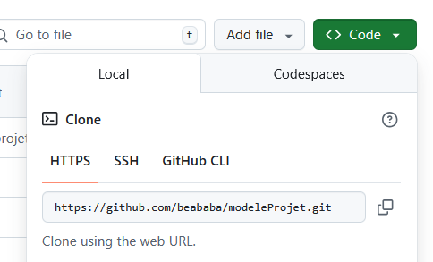
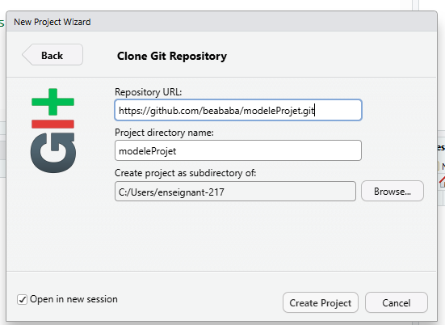
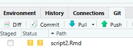
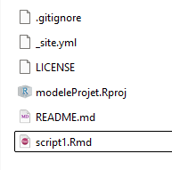
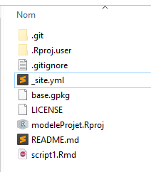

```{r setup, include=FALSE}
knitr::opts_chunk$set(echo = TRUE)
knitr::opts_chunk$set(cache = FALSE)
# Passer la valeur suivante à TRUE pour reproduire les extractions.
knitr::opts_chunk$set(eval = TRUE)
knitr::opts_chunk$set(warning = FALSE)
```

# Objet

A travers d'un modèle de projet disponible sur github <https://github.com/beababa/modeleProjet>, les notions suivantes sont abordées :

-   Markdown

-   Structure d'un projet R

-   Le .yml

-   Le site web

-   Lecture de .gpkg dans un script


L'idée est de récupérer le modèle de projet avec Rstudio et l'item *Nouveau projet / Version Control*



L'idéal serait de *pusher* les modifications faites en classe sur le dépôt.



# Markdown

Récupérer une cheatsheet par exemple, celle qui est intégrée dans R Studio,

menu *Aide / Cheatsheet / rmarkdown*

Détailler les parties les plus importantes pour la mise en forme.

Utiliser l'option *rendu*, observer les éléments proposés de l'en-tête Yaml

# Structure d'un projet R

 Détailler l'utilité de chaque fichier.

# Le .yml

<https://rmarkdown.rstudio.com/lesson-13.html>

exemple de .yml

```         
name: "modèle projet"
navbar:
  left:
    - text: "Script 1"
      href: script1.html
    - text: "Script 2"
      href: script2.html
  right:
    - icon: fa-github
      href: https://github.com/beababa/
output: 
  html_document:
    toc_float: TRUE  
    theme: united
    highlight: tango
```

Au niveau des thèmes : “default”, “cerulean”, “journal”, “flatly”, “readable”, “spacelab”, “united”, and “cosmo”.

# Le site web

Si le projet est bien structuré et que le \_site.yml, il suffit de faire le *rendu*

 Le rendu


# Basiques R

CTRL + ALT + I

CTRL + ENTREE

ALT + -


# Lecture du .gpkg

Récupérer le script et l'adapter à ses besoins. Le renommer de son prénom et si possible par le git le renvoyer sur la plateforme.

Adapter le script proposé à sa propre commune.
