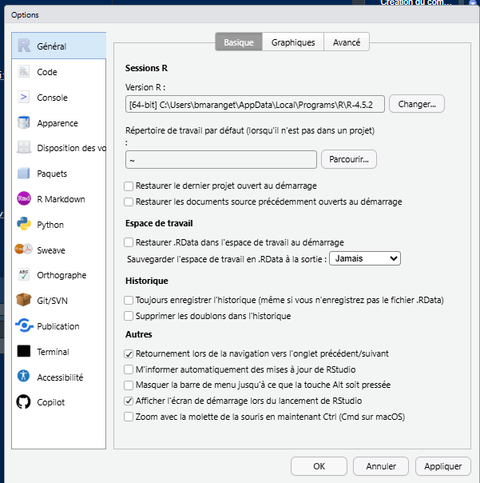
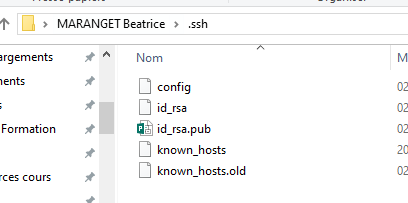

```{r setup, include=FALSE}
knitr::opts_chunk$set(echo = TRUE)
knitr::opts_chunk$set(cache = FALSE)
# Passer la valeur suivante à TRUE pour reproduire les extractions.
knitr::opts_chunk$set(eval = TRUE)
knitr::opts_chunk$set(warning = FALSE)
```

# Objet

Structure d'un projet R

Markdown

Lecture de .gpkg

Boucle d'ouverture

# Structure d'un projet R


```{r}
data <- read.csv("data/codeINSEEetudiant.csv")
part1 <- data [,(1:3)]
part2 <- data [,c(6,4,5)]
nom <- c("prénom", "groupe", "code")
names(part1) <- nom
names(part2) <- nom
tot <- rbind(part1, part2)
tot <- tot [!is.na(tot$groupe),]
```

37 étudiants (43 communes)

Faire compléter le tableau

## Première attribution par dpt

```{r}
tot$dpt <- substring(tot$code,1,2)
table(tot$dpt, tot$groupe)
```

première attribution : 44 / 92 / 93 / 93 + 95 / 92 + 94 etc ...

## Attribution par région

on procéde par région

```{r}
library(sf)
region <- st_read("data/region/regions-20180101.shp", quiet=T)
region <- st_transform(region, 2154)
region <- region [!region$code_insee %in% c("01", "02", "03","04","06","11"),]
idf <- region [region$code_insee == "11",]
drom <-region [region$code_insee %in% c("01", "02", "03","04","06"),]
commune <- st_read("data/cours5.gpkg", "commune", quiet = T)
joint <- merge(commune, tot, by = "code", all.x = T)
joint <- st_transform(joint, 2154)
```

```{r}
library(mapsf)
inter <- st_intersection(joint, region)
mf_map(region, col = "wheat", border = "cornsilk")
mf_map(inter, add = T)
mf_label(inter, var = "groupe", halo = T, overlap = F, cex = 1.2)
```

```{r}
table(inter$groupe, inter$nom.1)
```

2e attribution région Auvergne, Hauts, Pays de la Loire

## attribution finale

Chaque groupe inscrit sa région / son dpt dans le tableau + un nom de groupe + les prénoms

# Environnement de travail

Il s'agit de construire votre environnement de travail pour le projet de fin de semestre

A savoir :

-   git

-   R studio

-   R

La découverte de la plateforme data gouv et la fonction de ré-utilisation sera faite au cours prochain.

## Git

### Création du compte

github.com

### le site web

[créer un site web avec git](https://arfp.github.io/tp/git/github/20-github-pages)

## Rstudio et R

Distinguer les deux : langage et IDE

Attention, paramétrer les historiques sinon cela va générer de gros fichiers encombrants.



### Connexion R et git

[versionner son code](https://thinkr.fr/travailler-avec-git-via-rstudio-et-versionner-son-code/)

points de vigilance

-   création de la clé SSH dans Rstudio et recopie dans git

La clé se positionne dans le répertoire .ssh de votre profil utilisateur



### Premier script R

distinguer le data frame et le vecteur

```{r}
v1 <- c("ville1", "ville2")
v2 <- c("RN", "LFI")
df <- data.frame(ville = v1, vainqueur = v2)
df
df <- as.data.frame(v1,v2)
```

### Premier commit

Une fois le script enregistré il faut faire :

-   enregistrer les modifications = cocher les fichiers que l'on veut envoyer sur le serveur git

-   le commit (validation des modifications), mettre un message clair

-   le push
