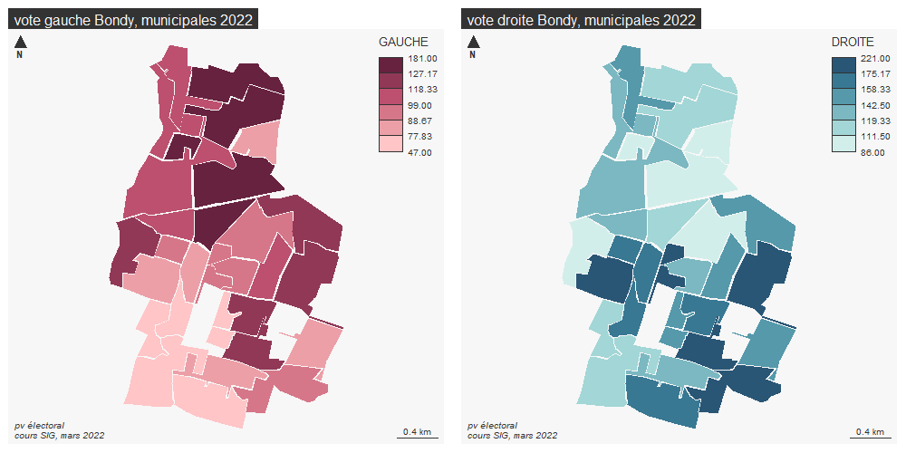
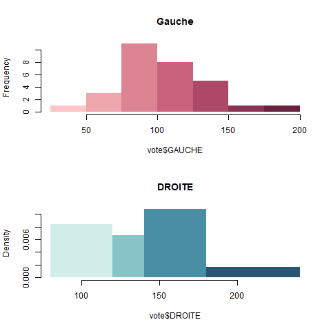
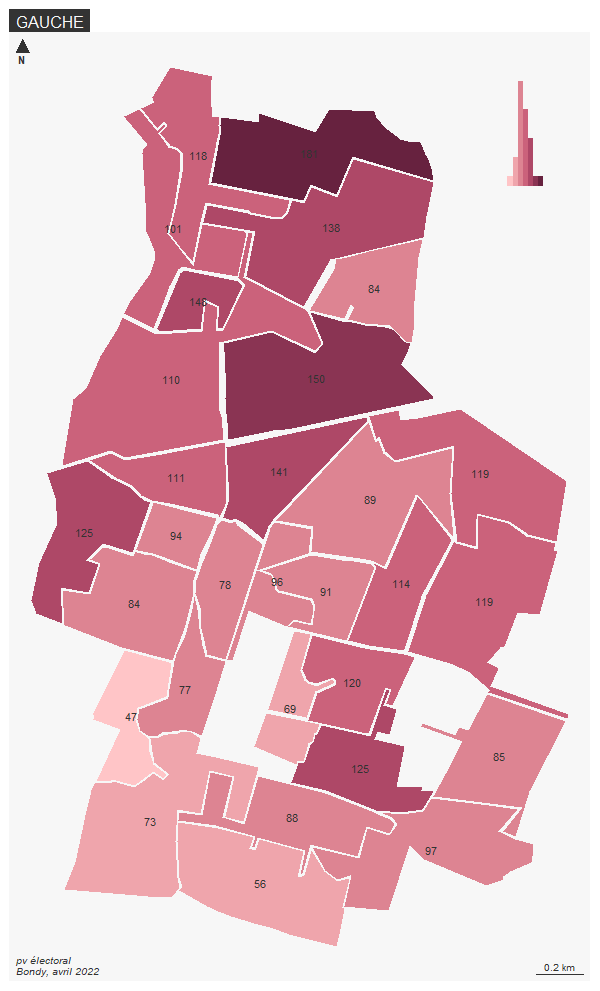
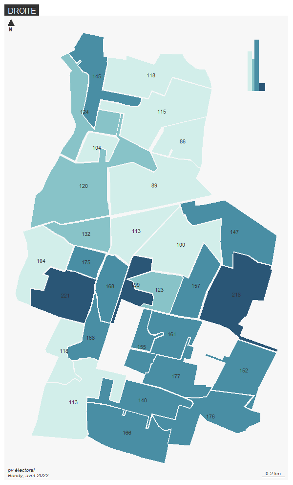

```{r setup, include=FALSE}
knitr::opts_chunk$set(echo = TRUE)
knitr::opts_chunk$set(cache = TRUE)
# Passer la valeur suivante à TRUE pour reproduire les extractions.
knitr::opts_chunk$set(eval = TRUE)
knitr::opts_chunk$set(warning = FALSE)
```

# Objet

2 cartographies électorales : correction

Montrer les erreurs à éviter
- mauvaise discrétisation
- nb couleurs insuffisants


# Import


```{r}
library(sf)
vote <- st_read("data/vote.gpkg", "jointure")
vote <- vote [,c(14,15)]
str(vote)
names(vote) [c(1,2)] <- c("GAUCHE", "DROITE")
```


# Première cartographie

```{r}
library(mapsf)
mf_export( vote, width = 1000, height = 500,  filename = "img/vote.png")
par(mfrow = c(1,2))
mf_map(vote, type = "choro", pal = "Burg",
       border = NA, var = "GAUCHE")
mf_layout(title = "vote gauche Bondy, municipales 2022", credits = "pv électoral\ncours SIG, mars 2022")
mf_map(vote, type = "choro", pal = "Teal",
       border = NA, var = "DROITE")
mf_layout(title = "vote droite Bondy, municipales 2022", credits = "pv électoral\ncours SIG, mars 2022")
dev.off()
```



références à noter 


pour les couleurs :

https://www.zeileis.org/assets/posts/2019-01-14-colorspace/hcl-palettes-1.png

pour la mise en page :

cheatsheet : base map et export map


# Discrétisation


## Les histogrammes

```{r}
summary(vote)
png("img/histo.png")
par (mfrow = c(2,1))
seuilG <- seq(25,200, by = 25)
hist(vote$GAUCHE, breaks = seuilG, col = hcl.colors(7,"Burg", rev = T), right = F,
     border = NA, main = "Gauche")
seuilD <- c(80,120,140,180,240)
hist(vote$DROITE, breaks = seuilD, col = hcl.colors(4, "Teal", rev = T), right = F, border = NA, main = "DROITE")
dev.off()
```



## Les cartes


```{r}
mf_export(vote, filename =  "img/resultG.png")
mf_map(vote, type = "choro" ,var = "GAUCHE", breaks = seuilG, pal =  hcl.colors(7,"Burg", rev = T), leg_pos = "n" , border = NA)
mf_label(vote, "GAUCHE")
mf_layout("GAUCHE",credits = "pv électoral\nBondy, avril 2022")
mf_inset_on (vote, pos = "topright")
par(mar = c(2,2,2,2))
hist(vote$GAUCHE, breaks = seuilG, col = hcl.colors(7,"Burg", rev = T), right = F,
     border = NA, main = "", xlab = "", ylab = "", axes = F)
mf_inset_off()
dev.off()
mf_export(vote, filename =  "img/resultD.png")
mf_map(vote, type = "choro", var = "DROITE", breaks = seuilD, pal =  hcl.colors(4,"Teal", rev = T), leg_pos = "n" , border = NA)
mf_label(vote, "DROITE")
mf_layout("DROITE", credits = "pv électoral\nBondy, avril 2022")
mf_inset_on (vote, pos = "topright")
par(mar = c(2,2,2,2))
hist(vote$DROITE, breaks = seuilD, col = hcl.colors(4,"Teal", rev = T), right = F,
     border = NA, main = "", xlab = "", ylab = "", axes = F)
mf_inset_off()

dev.off()
```




