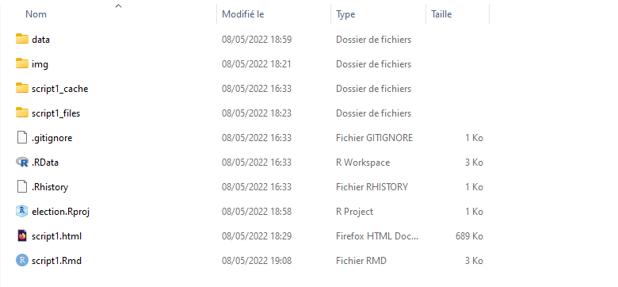
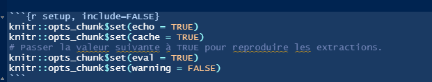

```{r setup, include=FALSE}
knitr::opts_chunk$set(echo = TRUE)
knitr::opts_chunk$set(cache = TRUE)
# Passer la valeur suivante à TRUE pour reproduire les extractions.
knitr::opts_chunk$set(eval = TRUE)
knitr::opts_chunk$set(warning = FALSE)
```

# Objet

Suite à la correction de devoir maison, faire quelques rappels afin de préparer au mieux le partiel.

# Structure du projet


## Arborescence

Reprendre la maquette (cf début de chaque cours)




Questions à se poser ?

## Chemins relatifs


```{r, eval=T}
getwd()
data <- read.csv("data/bondyElection.csv")
data <- read.csv("../03_coursDashboard/data/bondyElection.csv")
```

.. permet de remonter d'un répertoire

Conserver en mémoire que le knitr se fait dans le répertoire où est le .Rmd

## Paramétrages du script


Les options du débuts de script sont importantes.



Ainsi que celle au début de chaque chunk.


Passer le eval en FALSE permet de vérfier la mise en page d'un knit qui pose
problème.

Télécharger la maquette et modifier l'option dans le script.


A votre avis, warning et echo servent à quoi ?


# Cartographie

## Plot : une commande de base


```{r}
library(sf)
bureau <- st_read("data/vote.gpkg", "zone")
vote <- st_read("data/vote.gpkg", "jointure")
plot(bureau)
plot(bureau$geom, main = "les 31 bureaux de Bondy")
plot(vote, add = T)
```


## Map_sf : pour les cartes choroplètes... mais pas seulement


```{r}
library(mapsf)
insee <- st_read("data/insee.gpkg", "bondy")
mf_map(insee, type = "choro", var = "Men_pauv" )
mf_map(vote, type = "prop", var = "Nb.votes.nuls", leg_pos = "left")
```


## Leaflet : une carte de situation


Attention longitude et latitude

```{r}
library(leaflet)
leaflet() %>% setView(lng = 48.902199, lat = 2.482800 , zoom = 12) %>% addTiles()
leaflet() %>% setView(lat = 48.902199, lng = 2.482800 , zoom = 12) %>% addTiles()
```


# Fonctions spatiales


## Lecture des fichiers

- Chaque .gpkg peut avoir plusieurs couches

- Toujours mettre le contenu du fichier dans une variable

```{r}
data <- st_read("data/vote.gpkg")
st_layers("data/vote.gpkg")
data <- st_read("data/vote.gpkg", "inseeBondy")
```

## Jointure


La jointure permet de lier des données textes à une géométrie, dans notre cas, le résultat des votes
à la géométrie des bureaux (cf cours)

Pour les révisions, on constitue les données

```{r}
cle <- c(1:10)
lettre <- c(letters [1:10])
str(bureau)
bureauCle <- bureau [1:10, c("txVotants")]
bureauCle$cle <- cle
texte <- data.frame(cle, lettre)
jointure <- merge(bureauCle, texte, by = "cle")
mf_map(jointure)
mf_label(jointure, "lettre", halo = T, cex = 2)
```


## Intersection spatiale


On l'utilise pour croiser des données spatiales

```{r}
inter <- st_intersection(bureau, insee)
plot(inter$geom)
```


Attention, il peut y avoir des problèmes de validité de géométrie

```{r}
summary(bureau$geom)
summary(insee$geom)
summary(inter$geom)
# On force en polygone
inter <- st_cast(inter, "MULTIPOLYGON")
```

Cela signifie que l'on peut reprendre toutes les données des 2 couches.

```{r}
mf_map(inter, type = "choro", var = "txVotants" )
mf_map(inter, type = "prop", var = "Men_pauv", leg_pos = "left")
```


## Agrégation

L'agrégation permet de rassembler les valeurs sur des formes plus importantes, dans
notre cas, carreaux insee et bureaux de vote (cf cours R spatial dernière partie)


