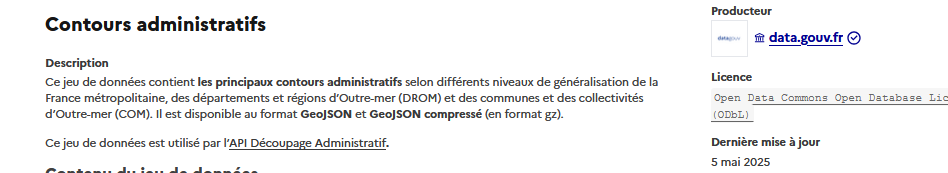
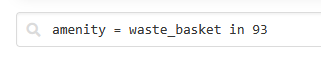
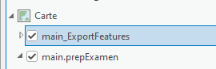
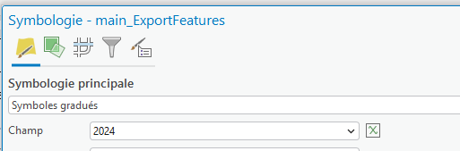
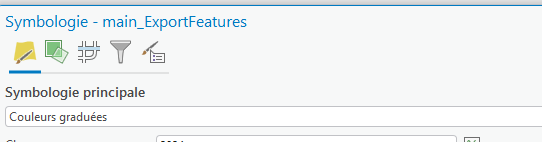
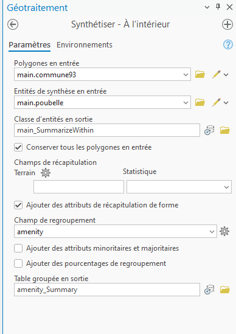

```{r setup, include=FALSE}
knitr::opts_chunk$set(echo = TRUE)
knitr::opts_chunk$set(cache = FALSE)
# Passer la valeur suivante à TRUE pour reproduire les extractions.
knitr::opts_chunk$set(eval = TRUE)
knitr::opts_chunk$set(warning = FALSE)
```

Ce cours correspond à une correction indicative pour les exercices préparatoires à l'examen. D'autres solutions sont possibles.

Librairies utilisées dans R

```{r}
library(sf) # traitement spatial
library(mapsf) # cartographie
library(terra) # pour les rasters
```

# Raster et vecteur

Les données seront fournies sous forme d'un *.gpkg* afin de permettre aux étudiants qui ne parviennent pas à les trouver de répondre aux questions suivantes.

Il sera demandé le lien vers les données aux étudiants qui ont réalisé la recherche.

## Plate formes

### Data.gouv

Chercher par exemple la géographie des limites communales, le meilleur mot clé est *contours administratifs*, Prendre le jeu du producteur data.gouv Choisir le [jeu le moins précis (à 1000 m)](https://www.data.gouv.fr/api/1/datasets/r/1e73c1a1-082f-4ad2-8bc3-78f25efa9e2f)



```{r}
commune <- st_read("data/communes-1000m.geojson", quiet = T)
mf_map(commune)
```

Aller voir avec Arcgis à quoi correspondent les territoires hors métropole...

### Copernic hub et plateforme LIDAR de l'IGN

Reprendre le cours onglet GT Rasters et MNT

### librarie R : happign

dans R, la librairie *happign* permet de récupérer toutes les données IGN de façon simple.

```{r}
library(happign)
bondy <- get_apicarto_cadastre("93010", type = "commune")
mf_map(bondy)
```

# Requête OSM et geojson

overpass.turbo permet de récupérer toutes les entités d'OSM

En cours, nous avons vu :

-   admin_level=8

-   highway=\*

-   name \~ "arbusse"

Si nous cherchons les poubelles, le tag sera *amenity=waste-basket* le faire sur votre département (in et le numéro du dpt)



Attention l'intégration du geojson dans Arcgis passe par l'utilisation d'un [outil spécifique](https://beababa.github.io/01_TD1.html#int%C3%A9grer-la-donn%C3%A9e-dans-arcgis)

# Dictionnaire de données

Le [tableau du données](https://beababa.github.io/01_TD1.html#quel-type-de-donn%C3%A9e) représente une base possible et non exhaustive

# Jointure attributaire

2 couches : commune et un tableau.

Pour le tableau, j'ai exporté le [nombre d'entreprises des statistiques locales]((https://statistiques-locales.insee.fr/#c=indicator&i=ds_flores.unit_loc&s=2024&t=A01&view=map1)


```{r}
commune93 <- commune [commune$departement == 93,]
nbEntreprise <- read.csv2("data/nbEntreprise.csv", skip = 2, na.strings = "N/A - résultat non disponible")
jointure <- merge(commune93, nbEntreprise, by.x= "code", by.y = "Code")
st_write(jointure, "data/prepExamen.gpkg", "jointure", delete_layer = T, quiet = T)
```

Penser à enregistrer les couches pour les récupérer le cas échéant sous Arcgis.

# Cartographie

Afin d'utiliser Arcgis pour la cartographie, il vaut mieux charger le .gpkg puis faire l'export dans la .gdb afin de ne pas avoir d'erreur.



Les en-têtes de colonne peuvent être modifiées.Par exemple,

Par exemple, *Nombre.d.établissements.2024* devient *2024*

Pour les symbologies

 

# Jointure spatiale

Pour faire un autre exemple, on récupère le contour des [géométries de l'ADEME](https://data-interne.ademe.fr/datasets/geo-contours-communes), résultat d'une recherche google *contours commune France*.

Récupération de la donnée

```{r}
commune <- st_read("data/Geo_Contours_Communes_2026.geojson", quiet = T)
poubelle <- st_read("data/poubelle.geojson", quiet = T)
```


Les étapes sont les suivantes : filtre sur le 93, validation de la géométrie

```{r}
commune93 <- commune [commune$DDEP_C_COD == '93',]
commune93 <- st_make_valid(commune93)
st_write(commune93 [,c(1,3)],"data/prepExamen.gpkg", "commune93", delete_layer = T, quiet = T)
st_write(poubelle [,c("amenity")], "data/prepExamen.gpkg", "poubelle", delete_layer = T, quiet = T)
```


jointure spatiale entre la couche des poubelles et celle des communes (même projection)


```{r}
jointure <- st_intersection(poubelle, commune93)
```


Pour voir le nombre de poubelles par commune, une table de dénombrement suffit.

```{r}
table(jointure$DCOE_C_COD)
```

Dans Arcgis, l'outil pourrait être *synthétiser à l'intérieur*


