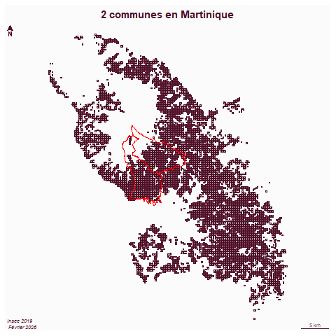
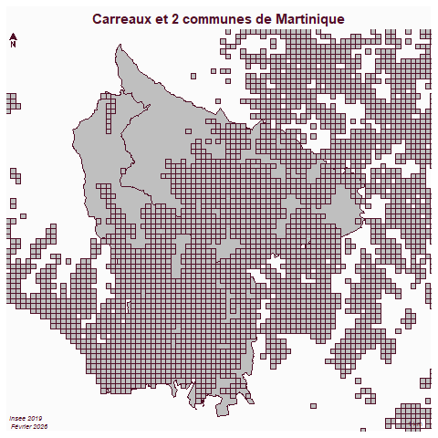
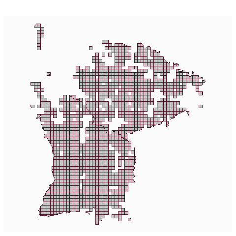

```{r setup, include=FALSE}
knitr::opts_chunk$set(echo = TRUE)
knitr::opts_chunk$set(cache = FALSE)
# Passer la valeur suivante à TRUE pour reproduire les extractions.
knitr::opts_chunk$set(eval = FALSE)
knitr::opts_chunk$set(warning = FALSE)
```

# Objet

Préparation des fichiers

# Récup des communes via API

```{r}
choix <- read.table("data/choix.csv", fileEncoding = "UTF-8")
choix2 <- read.csv("data/choixFinale.csv")
choix2 <- as.vector(choix2$choix.de.la.commune..code.INSEE.)
choix2 <- unique(choix2)
# 35 communes différentes
choix <- as.vector(choix$V1)
# Concaténation choix choix2
choix <- c(choix, choix2)
choix <- unique(choix)
```

49 choix différents en concaténant les 2 choix 

pb JSON to GEOJSON

à la main car pas de librairie simple trouvée et format=geojson ne fonctionne pas

https://geo.api.gouv.fr/communes?code=93010&fields=code,nom&format=geojson\$geometry=contour

On déconstruit et on reconstruit X Y multipoint / poly / sf

```{r}
# modele : https://geo.api.gouv.fr/communes?code=93010&fields=code,nom,contour
library(sf)
library(httr2)
df <- NULL
pb <- NULL
for (c in choix){
  print(c)
  url <- paste0("https://geo.api.gouv.fr/communes?code=", c, "&fields=code,nom,contour")
  rqt <- request(url)
  rep <- req_perform(rqt)
  data <- resp_body_json(rep)
  if (length(data)!=0) {
      # on extrati pas à pas
    #code <- c
    nom <-  unlist(data [[1]][2])
    data <- data [[1]][3]
    data <- data[[1]][2]
    data <- data [[1]][1]
    data <- unlist(data)
    Y <- data [c(seq(2,length(data), by = 2))]
    X <- data [c(seq(1,length(data)-1, by = 2))]
    pts <- NULL
      for (ind in c(1:length(X))){
        tmp <- c(X [ind],Y[ind])
        pts <- rbind(tmp, pts)
    }
  mp <- st_multipoint(pts) 
  poly <- st_cast(mp,"POLYGON")
  dfTMP <- st_as_sf(data.frame(code=c, nom=nom, geom=st_sfc(poly)))
  df <- rbind(dfTMP,df)
  }else{
    pb <- c(c,pb)
  }
}
pb
dfHorsMart <- df [substring(df$code,1,2)!=97,]
library(mapsf)
mf_map(dfHorsMart)
st_crs (df) <- 4326
df <- st_transform(df,2154)
```

cas 19e

```{r}
paris <- st_read("data/arrondissements.geojson", quiet=T)
paris <- paris [paris$c_arinsee == 75119, c("c_arinsee", "l_ar")]
names(paris)[1:2] <- c("code", "nom")
paris <- st_transform(paris,2154)
df <- rbind(df, paris)
```

```{r}
df$dpt <- substring(df$code,1,2)
table(df$dpt)
st_write(df, "data/cours5.gpkg", "commune", delete_layer = T, quiet = T)
```


# les carreaux

la base est filosofi 2019

l'idée est de faire une couche par dpt pour limiter le poids de l'opération d'intersection

```{r}
commune <- st_read("data/cours5.gpkg", "commune")
dpt <- unique(commune$dpt)
car <- st_read("data/gros/carreaux_200m_met.gpkg")
carMart <- st_read("data/gros/carreaux_200m_mart.gpkg")
```


```{r}
# intersection
inter <- st_intersection(car, commune)
communeMart <- commune [commune$dpt == 97,]
interMart <- st_intersection(carMart, st_transform(communeMart, st_crs(carMart)))
plot(interMart$geom)
st_write(inter, "data/gros/construction.gpkg", "car", delete_layer = T)
st_write(interMart, "data/gros/construction.gpkg", "carMart", delete_layer = T)
```

```{r}
car <- st_read("data/gros/construction.gpkg", "car")
car$dpt <- substring(car$lcog_geo,1,2)
dpt <- unique(car$dpt)
for (d in dpt){
  sel <- car [ car$dpt == d,]
  st_write(sel, "data/carDpt.gpkg", d, delete_layer = T)
}
carMart <- st_read("data/gros/construction.gpkg", "carMart")
st_write(carMart, "data/carDpt.gpkg", "97", delete_layer = T)
```
verif

```{r}
st_layers("data/carDpt.gpkg")
sel <- st_layers("data/carDpt.gpkg")
dpt2 <-sel$name
length(dpt2)
```
Il y a bien 23 dpt au total

# Extraction lg

```{r}
commune <- st_read("data/cours5.gpkg", "commune", quiet = T)
intersecterLimite <- function(commune){
  car <- st_read("data/gros/construction.gpkg", unique(commune$dpt), quiet = T)
  limite <- st_cast(st_geometry(commune), "MULTILINESTRING")
  # afin de récupérer toute la géométrie du carré
  car$intersecte <- sapply(st_intersects(car,limite ), length)
  inter <- car [car$intersecte>0,]
}
res <- NULL
insee <- commune$code
insee <- insee [-grep("^97",insee)]
for (i in insee){
  c <- commune [commune$code == i,]
  tmp <- intersecterLimite(c)
  res <- rbind(tmp, res)
}
st_write(res, "data/cours3.gpkg", "carLimite", delete_layer = T, quiet = T)
```

Pour le 97

```{r}
car <- st_read("data/gros/carreaux_200m_mart.gpkg", quiet=T)
commune <- commune [grep("^97",commune$code),]
commune <- st_transform(commune, 5490 )
```

```{r}
library(mapsf)
png("img/carreauxMart.png")
mf_map(car)
mf_map(commune, col = NA, border ="red",add = T)
mf_layout("2 communes en Martinique", "insee 2019\n Février 2026")
dev.off()
```



```{r}
png("img/carreauxMart2.png")
mf_map(commune)
mf_map(car,add = T)
mf_layout("Carreaux et 2 communes de Martinique", "insee 2019\n Février 2026")
dev.off()
```

 Intersection lg carreaux pour Martinique

```{r}
limite <- st_cast(st_geometry(commune), "MULTILINESTRING")
mf_map(limite)
car$inter <- sapply(st_intersects(car,limite ), length)
table(car$inter)
inter <- car [car$inter>0,"idcar_200m"]
st_write(inter,"data/cours3.gpkg", "carLimite97", delete_layer = T, quiet = T)
```

# Intersection

## Sans la Martinique

```{r}
commune <- st_read("data/cours5.gpkg", "commune", quiet = T)
commune <- commune [-grep("97", commune$dpt),]
dpt <- commune$dpt
# intersections
inter <- NULL
for (d in dpt){
  car <- st_read("data/gros/construction.gpkg", d, quiet=T)
  interTMP <- st_intersection(car, commune)
  inter <- rbind(interTMP, inter)
}
st_write(inter, "data/cours5.gpkg", "car", delete_layer = T, quiet = T)
```

Martinique

```{r}
commune <- st_read("data/cours5.gpkg", "commune", quiet = T)
commune <- commune [grep("97", commune$dpt),]
car <- st_read("data/gros/construction.gpkg", unique(commune$dpt), quiet=T)
st_crs(car)
commune <- st_transform(commune, 5490)
inter <- st_intersection(car, commune)
st_write(inter, "data/cours5.gpkg", "car97", delete_layer = T, quiet = T)
```

```{r}
png("img/interMartinique.png")
mf_map(inter)
dev.off()
```

 \# fichiers cours 3

uniquement men_pauv et recodage une couche par commune

on charge le 93 on affiche osm on charge commune on sélectionne et on crée une nelle couche on découpe car par commune on décoche les couches

# cours 4

On fait le rapport carreaux manquants / carreaux présents par dpt

```{r, eval=T}
library(sf)
st_layers("data/cours5.gpkg")
car <- st_read("data/cours5.gpkg", "car", quiet = T)
# 43 M carraux
carDpt <- as.data.frame(table(car$dpt) )
names(carDpt) <- c("dpt", "nb")
diff <- st_read("data/cours5.gpkg", "carreau_manquant", quiet = T)
diff$nb <- st_area(diff)/(190*190)
# contrôle sur Bondy
diff [diff$code == 93010, "nb"]
# envrion 7 carreaux
library(units)
diff$nb <- drop_units(diff$nb)
diff$nb <- round(diff$nb,0)
(sum(diff$nb)/ length(car$idcar_200m)) * 100
# plus du tiers des carreaux absents
diff$dpt <- substring(diff$code,1,2)
aggDiff <- aggregate(diff [,c("nb"), drop=T], by = list(diff$dpt), sum)
names(aggDiff) <- c("dpt", "nb")
jointure <- merge(carDpt, aggDiff, by = "dpt", all.x = T, all.y=T)
names(jointure) <-  c("dpt", "carTot", "carAbs")
jointure$rapport <- (round((jointure$carAbs)/(jointure$carTot),2))*100
```

```{r, eval=T}
plot(jointure$carTot, jointure$carAbs, log="xy", main = "rapport carreaux présents / absents par dpt", )
text(jointure$carTot,jointure$carAbs, jointure$dpt, pos = 4)
```

Tous les dpts au dessus de la droite de régression ont plus de carreaux absents que de carreaux totaux.

# Tri fichier

```{r}
st_layers("data/cours5.gpkg")
couches <- st_layers("data/cours5.gpkg")
couches <-  couches$name
couches
couche <- couches [c(2:6)]
for (c in couche){
  tmp <- st_read("data/cours5.gpkg", c, quiet=T)
  st_write(tmp, "data/base.gpkg", c, delete_layer=T, quiet=T)
}
st_layers("data/base.gpkg")
# reprise pour cours 7
commune <- st_read("data/cours5.gpkg", "commune")
st_write (commune, "data/cours7.gpkg", "commune")
```

# les communes des dpts

```{r}
dpt <- unique(substring(choix,1,2))
commune <- st_read("data/gros/communes-20220101.shp", quiet=T)
commune$dpt <- substring(commune$insee, 1,2)
commune <- commune [commune$dpt %in% dpt,]
st_write(commune, "data/gros/cours6.gpkg", "dpt", quiet=T, delete_layer = T)
```

```{r}
commune [commune$dpt == 97,]
```

Verif nb de dpts

```{r}
length(table(commune$dpt))
```

# les batiments dans le cadastre etalab

On récupère, dézippe et lit la donnée sous R

```{r}
url <- ("https://cadastre.data.gouv.fr/data/etalab-cadastre/2025-12-01/geojson/communes/93/93010/cadastre-93010-batiments.json.gz")
download.file(url, dest = "data/bat.json.gz")
library(R.utils)
gunzip("data/bat.json.gz")
bat <- st_read("data/bat.json")
```


# carreaux manquants pour communes finales


```{r}
commune <- st_read("data/projet.gpkg", "commune")
car <- filosofi  [filosofi$lcog_geo %in% commune$code_insee,]
length(names(table(car$lcog_geo)))
```

Il en manque 2

```{r}
st_write(car, "data/projet.gpkg", "car")
```
```{r}
# on agrège les carreaux par dpt
car$dpt <- substring(car$lcog_geo,1,2)
aggCar <- aggregate(car [, c( "dpt")], by = list(car$dpt), length)
# même opération sur les communes
aggCommune <- aggregate(commune [, "code_dep"], by=list(commune$code_dep), length)
names(aggCar)[1:2] <- c("dpt", "nb")
names(aggCommune)[1:2] <- c("dpt", "nb")
diff <-  NULL
commune <- commune[commune$code_dep != 97,]
dpt <- unique(commune$code_dep)
st_crs(aggCar)
st_crs(aggCommune)
aggCommune <- st_transform(aggCommune, 2154)
commune <- st_transform(commune, 2154)
for (d in dpt){
  print(d)
  tmp <- st_difference(aggCommune [aggCommune$dpt == d, c("dpt")], aggCar [aggCar$dpt == d, c("dpt")])
  diff <- rbind(tmp, diff)
}
```

```{r}
#diff <- st_cast(diff,"POLYGON")
inter <- st_intersection(diff, commune)
inter <- inter [, c("gid", "nom_com")]
st_write(inter , "data/projet.gpkg", "carreau_manquant", delete_layer = T, quiet = T)
st_layers("data/projet.gpkg")
```


# données examen


## Orthophoto Bondy

bondy.tif dans gros

## Carreaux

pb le requêteur de carreaux idf ne fonctionne pas donc on intégre les carreaux
par dpt

```{r}
st_layers("data/carDpt.gpkg")
```


## sujet 1 : carte scolaire

- limite Bondy
- écoles Bondy
- carreaux bondy


```{r}
ecole <- st_read("data/ecole.geojson")
ecole <- st_centroid(ecole)
bondy <- commune [commune$code == 93010,]
car93 <- st_read("data/carDpt.gpkg", "93")
```

enregistrement


```{r}
st_write(ecole, "data/examen1.gpkg", "ecole", delete_layer = T)
st_write(bondy, "data/examen1.gpkg", "commune", delete_layer = T)
st_write(car93, "data/examen1.gpkg", "carreauFilosofi93", delete_layer = T)
st_layers("data/examen1.gpkg")
```


Filtres

```{r}
carBondy <- carBondy [grep(93010, carBondy$lcog_geo),]
ecole <- st_transform(ecole, 2154)
ecole <- ecole [ecole$school.FR == "élémentaire",] 
```

carto

```{r}
mf_map(bondy)
mf_map(carBondy, add = T, col = NA)
mf_map(ecole, add = T, col ="red")
```


## Examen 2 : SIG


- cadastre
- bat
- carreaux

```{r}
cadastre <- st_read ("data/dataCours1/cadastre-93010-parcelles.json")
st_write(cadastre, "data/examen2.gpkg", "cadastre")
st_write(car93, "data/examen2.gpkg", "carreauFilosofi93")
bat <- st_read("data/gros/buildingOSM.geojson")
bat <- st_collection_extract(bat,"POLYGON")
bat <- st_cast(bat, "POLYGON")
bat <- bat [, "building"] 
plot(bat$geometry)
st_write(bat, "data/examen2.gpkg", "batOSM")
```
```{r}
car93 <- st_transform(car93, 4326)
mf_map(cadastre)
mf_map(car93, add = T , col = NA, border = "green")
mf_map(bat, add = T, col=NA, border ="red")
```


```{r}
st_layers("data/examen2.gpkg")
```

s

## Examen 3 = carte électorale


```{r}
equipement <- st_read("data/amenity.geojson") 
equipement <- equipement [, "amenity"] 
equipement <- st_centroid(equipement)
st_write(equipement, "data/examen3/examen3.gpkg", "equipementOSM", delete_layer = T)
```


```{r}
bv <- st_read("data/gros/bureau-de-vote-insee-reu-openstreetmap.gpkg")
bvSel <- bv  [bv$insee %in% commune$code,]
# verif
length(unique(bvSel$insee))
setdiff( commune$code, bvSel$insee)
bvParis <- bv [ bv$insee == 75056,]
bvParis$arr <- substring(bvParis$bureau, 4,5)
bvParis19  <- bvParis [bvParis$arr == 19,]
bvParis19 <- bvParis19 [,-7]
bvSel <- rbind(bvSel, bvParis19)

bvSel$bureauCourt <- substring(bvSel$bureau, 7,10) 

st_write(bvSel, "data/examen3/examen3.gpkg", "bv")
st_write(car93, "data/examen3/examen3.gpkg", "carreauxFilosofi93")
```

```{r}
res <- read.csv2("data/gros/municipales-2026-resultats-bv-par-communes-2026-03-20.csv")
res$bureauCourt <- as.integer(res$Code.BV)
resSel <- res [res$Code.commune %in% commune$code,]
str(res)
resBondy <- res [res$Code.commune == 93010,]
bvBondy <- bvSel [bvSel$insee == 93010,]
# verif
bvBondy$bureauCourt
resBondy$bureauCourt
jointure <- merge(bvBondy, resBondy, by = "bureauCourt")
```


```{r}
mf_map(jointure, type ="choro", "Voix.1")
mf_map(car93, add = T, col=NA, border ="red")
```

```{r}
st_layers("data/examen3/examen3.gpkg")
write.csv(resBondy, "data/examen3/resultatBondy.csv")
st_write(bvBondy, "data/examen3/examen3.gpkg", "bvBondy")
write.csv(resSel, "data/examen3/resultat.csv")
```


Eclatement fichier .pdf

```{r}
library(pdftools)
pdf_subset("data/SUJET 2026 - EXAMEN L6ECSIG.pdf",1, output = "data/sujet1.pdf")
pdf_subset("data/SUJET 2026 - EXAMEN L6ECSIG.pdf",2, output = "data/sujet2.pdf")
pdf_subset("data/SUJET 2026 - EXAMEN L6ECSIG.pdf",3, output = "data/sujet3.pdf")
```

