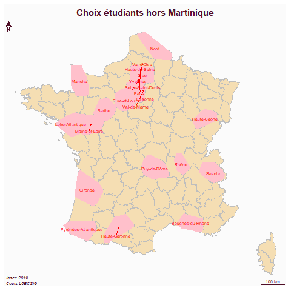

```{r setup, include=FALSE}
knitr::opts_chunk$set(echo = FALSE)
knitr::opts_chunk$set(cache = TRUE)
# Passer la valeur suivante à TRUE pour reproduire les extractions.
knitr::opts_chunk$set(eval = FALSE)
knitr::opts_chunk$set(warning = FALSE)
```

# Objet

L6ECSIG Construction et utilisation des SIG 2025/26

(Gr. 6 et , Jeudi 16h30 - 19h30 Salle 217 sur le campus de Clignancourt)

L'idée du cours est de consolider les acquis de la L2 et de familiariser les étudiants à Arcgis pro et au codage avec R (une plateforme de versioning très utilisée.)

La thématique utilisée est *Commune pauvre et/ou riche ?*

# Données

-   limites communes dans OSM

-   carreaux filosofi 200 m (données infra communales)

-   données ofgl (données communales)

# Déroulé

```{r, eval = TRUE}
data <- read.csv("data/deroule.csv", header = T, fileEncoding = "UTF-8")
knitr::kable(data)
```

# Evaluation

régime du contrôle continu,

Deux notes :

-   une partiel

-   une note maison (+ les exercices pour moitié de la note maison)

Le partiel sera sur machine d'une durée de 1h30 : - un exercice sous Arcgis Pro (10 pt) - et un autre sous R(10 pt) (avec un rendu en .pdf)

## Barème du projet (sur 10 points)

Merci de déposer votre lien vers votre site web à avant le 19 avril (voir le moodle)

*Tous les étudiants remplissent le moodle* et consignent prénom / nom du groupe / lien

-   1 pt lien valide site web au 19 avril

-   2 pt sur la donnée (sa description)

-   2 pt sur la problématique (présentée le 9 avril mais modifiée en fonction des observations, ne pas oublier de faire une introduction et une conclusion)

-   2 pt sur les GT vecteurs (avec schéma de géotraitement obligatoire)

-   2 pt sur les GT Rasters (idem)

-   1 pt sur les jointures

La correction sera déposée avec le détail des points sur le moodle.

# Données

Il s'agit de vos données pour la commune choisie. Principalement :

-   OFGL

-   Filosofi

-   communes choisies

```{r, eval=TRUE}
choix <- read.csv("data/codeINSEEetudiant.csv")
choix <- c(choix$choix.de.la.commune..code.INSEE., choix$choix.de.la.commune..code.INSEE..1)
# on enlève les NA et les villes identiques
choix <- unique(choix[!is.na(choix)])
choix <- c(choix,93010,70550,60508,78311,93045,93005,13040,92044)
write.table(choix, "data/choix.csv", fileEncoding = "UTF-8", row.names = F, col.names = F)
```

42 communes + Bondy

Récupération des carreaux 200 m pour les communes

```{r, eval=FALSE}
library(sf)
filosofi <- st_read("data/gros/carreaux_200m_met.gpkg", quiet=T)
filosofi$dpt <- substring(filosofi$lcog_geo,1,2) 
dpt <- unique(substring(choix, 1,2)) 
choisir <- function(dpt){
  data <- filosofi [grep(dpt, filosofi$dpt),]
  st_write(data  , "data/gros/construction.gpkg", dpt, delete_layer = T, quiet=T)
}
res <- lapply(dpt, choisir)
```

Attention au 97, il faut prendre un autre fichier filosofi

```{r, eval=FALSE}
library(sf)
choix <- read.csv("data/choix.csv", header = F)
choix <- choix [grep("^97", choix$V1),]
mart <- st_read("data/gros/carreaux_200m_mart.gpkg", quiet=T)
st_write(mart,"data/gros/construction.gpkg", "97", delete_layer = T)
```

# Cartographie

```{r}
library(sf)
library(mapsf)
st_layers("data/gros/construction.gpkg")
couches <- st_layers("data/gros/construction.gpkg")
# 23
couches <- couches$name
couches <- couches [couches != '97']
couches <- couches [couches != 'commune']
union <- NULL
for (c in couches){
  tmp <- st_read("data/gros/construction.gpkg", c, quiet=T)
  tmp <- st_union(tmp$geom)
  tmp <- st_as_sf(tmp)
  union <- rbind(tmp,union)
}
union <- st_convex_hull(union)
dpt <- st_read("data/departements.geojson", quiet=T)
dpt <- st_transform(dpt, 2154)
dptSel <- dpt [dpt$code %in% couches,]
```

```{r}
png("img/choixEtudiant.png")
mf_map(dpt, col = "wheat", border="grey")
mf_map(union, col = "pink", border = NA, add = T)
mf_label(dptSel, var = "nom", cex = 0.6, overlap = F, col ="red")
mf_layout("Choix étudiants hors Martinique", "Insee 2019\nCours L6ECSIG")
dev.off()
```



# Ressources

[Argis, learn arcgis](https://learn.arcgis.com/fr/gallery/#?p=arcgispro)

[R la base](https://framabook.org/r-et-espace/)

[librairie sf](https://r-spatial.github.io/sf/)

[Le cours que vous n'avez pas eu](https://rgeocarto.github.io/)

Données communales

[Requeteur de carreaux sur site IDF](https://data.smartidf.services/explore/dataset/demographyref-france-donnees-carroyees-200m-millesime/information/?disjunctive.com_arm_code&disjunctive.year&disjunctive.com_code&disjunctive.com_arm_name&disjunctive.com_name&disjunctive.epci_name&disjunctive.epci_code&disjunctive.dep_name&disjunctive.dep_code&disjunctive.reg_name&disjunctive.reg_code)

[data.gouv](https://www.data.gouv.fr/pages/donnees-geo)

[insee](https://www.insee.fr/fr/information/3544265)
